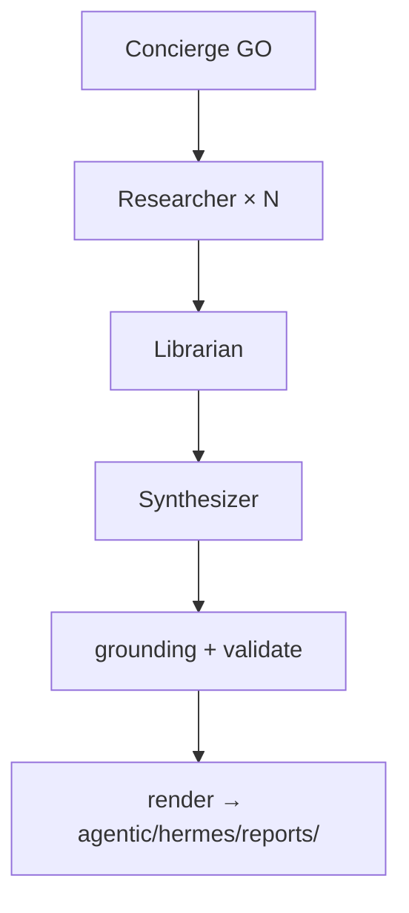

# Architecture & Design Summary

> **Canonical narrative:** [`README.md`](../../README.md) at the repo root. **If this
> doc conflicts with README, README wins.**

AI Digest is a **local-first ORIO agent crew** (Concierge → Researcher × N →
Librarian → Synthesizer) on Hermes kanban, then deterministic grounding,
validate, and render. **Production GO** is `manage.py go` / Concierge `digest_go`.
Everything runs on one workstation (Ollama + Instructor); no cloud keys are required.

The sections below on **ingest → enrich → validate → render** describe the
**shared library stages** inside `llm_pipeline/` — used by both the agentic path
(deterministic tail + warm cache) and the **batch escape hatch** (`go --pipeline`
/ deprecated `run.py`). They are not the product orchestration story.

## Production GO (agentic)

See root README and [`system_roles.md`](../../agentic/hermes/system_roles.md).



| Stage | Default GO | Batch `--pipeline` |
|---|---|---|
| Orchestration | Hermes kanban workers | `pipeline_go.run_production_pipeline` |
| Ingest | Warm cache + lazy worker tools | `lib.ingest.stage1` batch |
| Enrich | Role LLMs (research / librarian / synthesizer) | `enrich_digest` |
| Invariants | grounding + validate | **Same code paths** |
| Output | `agentic/hermes/reports/` | `agentic/hermes/reports/` |

The staged batch CLI (`run.py`) is **deprecated orchestration**;
`llm_pipeline/` remains as shared libraries until fully inlined.

Deep dive: [`agentic/hermes/docs/ARCHITECTURE.md`](../../agentic/hermes/docs/ARCHITECTURE.md).
Runbook: [`agentic/hermes/POC.md`](../../agentic/hermes/POC.md).

---

## Shared stages (libraries + batch escape hatch)

`run.py` (and `go --pipeline`) orchestrates a strict `ingest → enrich → validate → render`
flow. Each stage is wrapped in a diagnostics `collector.stage(...)` context so timings,
token counts, and failures are captured for the waterfall.

```
run.py / go --pipeline
 ├─ [1] Ingest    preflight skeleton (curated feeds) + Crawl4AI leaderboards
 │                + structured-API leaderboards (SWE-bench, EvalPlus)
 ├─ [2] Enrich    multi-pass local LLM: summarize, score, gap-fill, curate,
 │                (optional) tool-loop link repair, carry-forward
 ├─ [3] Validate  category counts, significance, grounding guard
 └─ [4] Render    digest JSON → HTML + reports/index.html + diagnostics/*
```

## Stage 1 — Ingest (`pipeline/fetch.py`, `vendor/.../scripts/preflight.py`)

- **Preflight** builds a *skeleton*: curated per-category feeds (theAIsearch
  chapters, typography, research, robotics, llm-stats) parsed into story stubs.
- **Crawl sources** — JS-rendered leaderboard pages with no API are fetched by
  Crawl4AI into `.cache/<prefix>/crawl/*.md`, then parsed by
  `pipeline/leaderboards.py`.
- **Structured-API sources** — endpoints publishing JSON (registered in
  `pipeline/structured_sources.py`) are fetched into `.cache/<prefix>/structured/`
  and parsed into rows. Toggle via `ingestion.structured_sources.enabled`.

## Stage 2 — Enrich (`pipeline/enrich.py`)

Multi-pass, orchestrated by `enrich_digest` → `_enrich_multipass`:

- **Pass 1 — skeleton categories:** score + summarize curated stories in batches
  (`stories_per_batch`), then curate to `category_targets`. Stamped
  `skeleton:<cat>`.
- **Pass 2 — leaderboard:** the crawled leaderboard markdown becomes stories,
  stamped `crawl:leaderboard`.
- **Pass 3 — gap fill:** categories with no scraped feed (analytics, agentic-ai,
  llm, rag, image-gen, design-ai, robotics) are filled by the LLM in chunks
  (`gap_categories_per_call`), stamped `gap:<cat>`; empty categories are re-asked
  (`gap_fill_retries`), stamped `gap-refill:<cat>`.
- **Tool loop (optional, default-off):** the model may call `verify_url` /
  `web_search` (`pipeline/tools.py`) to check and repair gap links before the
  deterministic guard runs.
- **Carry-forward (safety net):** if a required category is still empty, seed it
  from the most recent in-window prior digest (already-verified links), stamped
  `carry:<prefix>` and flagged `carried_forward`.
- **Pass 4 — daily summary** + aisearch video metadata.

If `llm.enabled` is false, `_promote_skeleton` publishes the unscored skeleton.

## Stage 3 — Validate (`pipeline/validate.py`, `pipeline/grounding.py`)

- **Grounding guard** is the pipeline's deterministic *self-check*: a story whose
  `url` is a bare domain, a known leaderboard *root*, or (when an ingestion
  allow-set is supplied) a URL the model was never shown is **ungrounded**. The
  guard *keeps the topic* but demotes the link (`url → None`, `source_pending`)
  so a real development is never lost to a fake link. The `leaderboard` category
  legitimately cites roots and is exempt.
- **Validation** checks `min_total_stories`, `min_categories`, and
  `required_category_ids` (see `config.yaml`).

## Stage 4 — Render (`pipeline/render.py`)

- Writes the digest JSON (stamping `generator_version = <release>.<prefix>`),
  then inlines the browser widget (`vendor/ai-news-digest/digest-app.js`) and
  content template into `<prefix>.html`.
- Rebuilds `reports/index.json` + `reports/index.html` (the archive frame with
  the latest digest embedded, heatmap, nav, author card, site footer).
- `_crawl_driven_leaderboards` overwrites the template's seed leaderboard rows
  with the run's live crawl + structured data so a tab is never stale.

## Data model (`pipeline/schema.py`)

- `Story` is the published shape: `id, title, summary, source, url?,
  significance(1-5), novelty, relevance_design, tags[], image_url?,
  source_pending, provenance?`.
- `StoryEnrich` is the **LLM response** model — deliberately identical *except it
  has no `provenance`*. Provenance is deterministic pipeline metadata stamped
  after enrich (`_with_provenance`); the model must never author its own origin.
- `CategoryStories` / `GapCategories` / `DigestHeader` are the structured-output
  envelopes Instructor validates each LLM call against.

## The browser widget (`vendor/ai-news-digest/`)

- `digest-app.js` renders cards, filters, donut/significance/tag charts, the
  leaderboard tabs, the provenance `(i)` popover, and the one-click copy icon.
  Pure logic is exported behind a `module.exports` guard so Node can unit-test it
  with no DOM (`digest-app.test.js`).
- `content.template.html` holds the card CSS; `frame.html` is the archive shell.
- `scripts/_report_utils.py` + `rebuild_index.py` build the HTML/index; the
  `pipeline/render.py` layer wraps them for the staged run.

## Key design decisions (and the options weighed)

- **Local LLM over cloud API:** reproducible, key-free, portfolio-friendly.
  (Options: cloud API — cost/keys; no LLM — too shallow; local Ollama — chosen.)
- **Deterministic guard over a second LLM judge:** offline models can't reliably
  tell a real link from a convincing fake, so grounding is rule-based and
  auditable. (Options: LLM self-critique; human review; deterministic guard —
  chosen for honesty + repeatability.)
- **Re-render decoupled from re-enrich:** UI/render changes ship via a
  deterministic re-render of existing JSON, never a fresh LLM run, so a good
  report is never risked for a cosmetic change.
- **Provenance as pipeline metadata, not model output:** guarantees the trace is
  trustworthy and can't be hallucinated.
