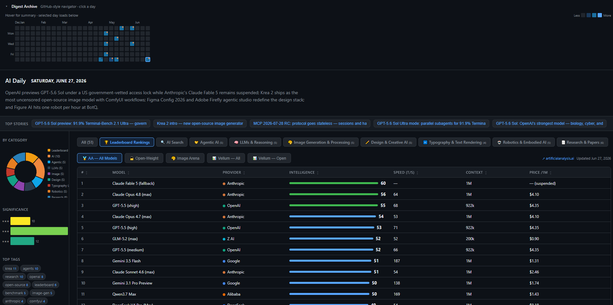

# 📰 AI Digest



Local-first pipeline for a daily AI news digest. It ingests public sources, runs a multi-pass LLM enrich step, and publishes interactive HTML archives with per-run diagnostics.

Staged design: explicit ingest → enrich → validate → render steps, typed schemas, and a diagnostics waterfall you can open in the browser.

👤 **Author:** [Ameen Demiry](https://www.linkedin.com/in/ademiry/) · [Portfolio](https://demiry.net/)

---

## 🌐 GitHub Pages

Live site on **`main`**: `https://YOUR_USER.github.io/AI_Digest/` (digest archive + ⚙️ diagnostics). Enable **Settings → Pages → GitHub Actions**. Work on **`dev`**, merge to **`main`** to publish.

---

## 🖥️ Hardware (local runs)

Enrichment runs on a **consumer-grade NVIDIA RTX 4090** 🎮 workstation via **Ollama** (`qwen3.6:35b`). No cloud API keys required for the default pipeline. Typical full run: ~10-12 minutes, ~150-200k tokens (see `diagnostics/` for the sample run).

---

## 🚀 Quick start

```powershell
git clone https://github.com/YOUR_GITHUB_USER/AI_Digest.git
cd AI_Digest
python -m venv .venv
.\.venv\Scripts\activate
pip install -r requirements.txt
playwright install chromium

ollama pull qwen3.6:35b
python run.py --start 2026-06-29 --history 10
```

| Path | Contents |
|------|----------|
| `reports/` | 📄 Digest JSON/HTML + **`index.html`** archive (tracked) |
| `diagnostics/` | 📈 Timing/token telemetry + archive frame (tracked) |
| `.cache/` | 🗄️ Prefetch cache (gitignored) |
| `.preflight/` | 📥 Raw preflight JSON (tracked) |

Open locally: `reports/index.html` 🌍

---

## ⚙️ What it does

```
run.py
  ├─ [1] 📥 Ingest   theAIsearch chapters, typography, research, llm-stats, Crawl4AI leaderboards
  ├─ [2] 🧠 Enrich   Local Ollama + Instructor: multi-pass summarize, score, gap-fill, curate
  ├─ [3] ✅ Validate Category counts, significance scores
  └─ [4] 🎨 Render   HTML + reports/index.html + diagnostics/*
```

Eleven editorial categories with production-style story targets.

---

## 💡 Inspiration & credits

Editorial format inspired by **[theAIsearch](https://www.youtube.com/@TheAiSearch)** 🎬: one story per video chapter, scored by coverage depth.

**Third-party:** [Ollama](https://ollama.com/) 🦙, [Instructor](https://github.com/jxnl/instructor), [Pydantic](https://docs.pydantic.dev/), [Crawl4AI](https://github.com/unclecode/crawl4ai), [Playwright](https://playwright.dev/), [yt-dlp](https://github.com/yt-dlp/yt-dlp), [D3.js](https://d3js.org/). Public data from Artificial Analysis, Vellum, Arena.ai, Typographica, HuggingFace Papers, arXiv.

---

## 🗺️ Roadmap

This repo stays the deterministic core. Planned next:

- [ ] **Self-scheduling agent** 🤖 (Hermes or OpenClaw): run daily, read diagnostics regressions, propose config tuning
- [ ] **Hybrid RAG**: link new stories to related topics and threads from past digests

---

## 📄 License

[MIT](LICENSE) · [LinkedIn](https://www.linkedin.com/in/ademiry/) · [Portfolio](https://demiry.net/)
