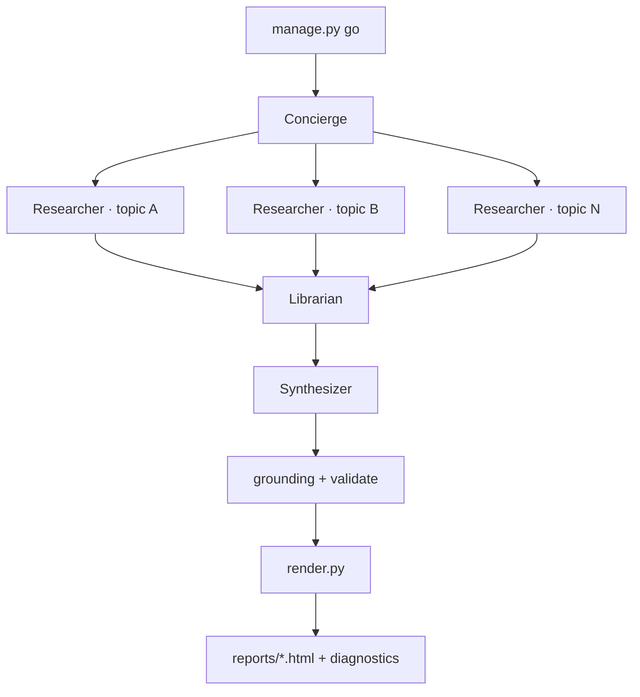

<p align="center">
  
</p>

<p align="center">
  
  <br>
  <strong>Showcase demo: ORIO — agentic architecture for a daily AI news digest</strong>
  <br>
  <em>Open Research Intelligence Observatory</em> · Hermes crew + Oreo mascot
  <br>
  <a href="https://mameen.github.io/AI_Digest/">Live site</a> ·
  <a href="agentic/hermes/docs/ARCHITECTURE.md">Architecture</a> ·
  <a href="agentic/hermes/POC.md">Run the POC</a>
</p>

---

Four roles. One digest. Each agent has a job — and a mascot.

<table>
<tr>
<td align="center" width="25%">
  <br>
  <strong>Concierge</strong><br>
  <small>Your single point of contact.<br>
  Keeps the standing topic list and schedule; tells <code>GO</code> from “add a topic.”<br>
  Assembles the kanban board — never fetches sources or writes stories.</small>
</td>
<td align="center" width="25%">
  <br>
  <strong>Researcher</strong><br>
  <small>Parallel worker — one target per task<br>
  (category, feed cluster, or source bundle).<br>
  Fetches pages, extracts facts, returns structured notes with URLs.<br>
  Does not merge across topics or write the digest.</small>
</td>
<td align="center" width="25%">
  <br>
  <strong>Librarian</strong><br>
  <small>Fan-in after all researchers finish.<br>
  Dedupes overlap, classifies stories into topics, regroups categories,<br>
  and maps a knowledge graph onto the standing topic list.<br>
  Outputs a curated skeleton — not final prose.</small>
</td>
<td align="center" width="25%">
  <br>
  <strong>Synthesizer</strong><br>
  <small>Reads the librarian graph and composes the finished briefing.<br>
  Executive takeaway, daily summary, category narratives → digest JSON.<br>
  Does not re-fetch or reclassify; grounding runs downstream.</small>
</td>
</tr>
</table>

**AI Digest** (codename **ORIO** — *Open Research Intelligence Observatory*) turns noisy AI news into a polished daily briefing — HTML archive, heatmaps, leaderboards, and per-run diagnostics. Hermes profiles use `orio_*` code names (**Concierge**, **Researcher**, **Librarian**, **Synthesizer** in the UI). A concierge fans out parallel researchers; a librarian merges and classifies findings; a synthesizer writes the report. Deterministic code verifies every link before anything publishes.

Built on [**Hermes Agent**](https://hermes-agent.nousresearch.com/) (Nous Research). Local LLMs via [Ollama](https://ollama.com/) — no cloud API keys. Every story traceable to its source.

### How it evolved

It started as a **Claude skill** — a simple daily briefing prompt. That worked until
the gaps showed up: some sources need dedicated tooling, not just a longer prompt.
YouTube chapters, leaderboard crawls, and structured API fetches each wanted their
own extractors, not improvisation in chat.

That pushed the project into a **staged LLM pipeline** (`llm_pipeline/`) — ingest,
enrich, validate, render — which proved the digest format and grounding model.
At scale, though, sequential runs became hard to **debug and extend**: one long
batch job, opaque failures, and every new source meant more pipeline wiring.

The **agentic** cutover was the natural next step. Role-based workers can retry,
adapt, and fan out in parallel; the concierge handles intent (`GO` vs “add a
topic”); researchers call lazy ingest tools only when cache misses. Agents
**self-heal** around flaky sources instead of aborting the whole run. The
deterministic guard still has the last word on links and provenance.

What you see in this repo — `agentic/hermes/` — is a **bootstrap snapshot**: enough
to reproduce the architecture, run E2E locally, and publish showcase reports to
GitHub Pages. The **production system** now lives and runs on my server; this
repository is the reference implementation and portfolio demo.

→ Early pipeline exploration: [`docs/LLM_PIPELINE.md`](docs/LLM_PIPELINE.md)

<p align="center">
  <a href="https://mameen.github.io/AI_Digest/reports/20260707182407.html">
    
  </a>
  <br><sub>Daily digest — categories, leaderboards, charts, provenance on every story</sub>
</p>

<p align="center">
  <a href="https://mameen.github.io/AI_Digest/diagnostics/20260707182407.diagnostics.html">
    
  </a>
  <br><sub>Agent diagnostics — concierge → research → librarian → synthesizer → render</sub>
</p>

<p align="center">
  <a href="https://mameen.github.io/AI_Digest/index/index.html">
    
  </a>
  <br><sub>Archive analytics — activity heatmap and topic trends across runs</sub>
</p>

---

### Agent flow



| Layer | What happens |
|-------|----------------|
| **Orchestration** | Hermes kanban — tasks, profiles, `manage.py` hooks |
| **Research** | Parallel researcher workers, lazy ingest tools on cache miss |
| **Curation** | Librarian artifact — dedupe, classify, knowledge graph |
| **Authoring** | Synthesizer → `synthesize_digest` (Instructor structured output) |
| **Invariants** | `grounding.py` + `validate.py` — same modules, not agent-judged |
| **Output** | Digest JSON → HTML widget, archive index, diagnostics waterfall |

Agents propose; the pipeline disposes. Links, categories, and provenance tokens are stamped by deterministic code after synthesis — never trusted from model output alone.

### Quick commands

```bash
# Bootstrap (once)
python agentic/hermes/admin/manage.py bootstrap

# Full E2E run
python agentic/hermes/admin/manage.py go --fresh

# Diagnostics waterfall for a run
python agentic/hermes/admin/manage.py diagnostics --prefix 20260707182407

# Publish to GitHub Pages
python scripts/deploy_app.py --agentic-hermes --one-day 20260707182407 --not-dry-run
```

Tests: `python run_tests.py` — real fixtures, no mocks (see [AGENTS.md](AGENTS.md)).

---

## Deep dives

| Topic | Doc |
|-------|-----|
| **Run it locally** | [`agentic/hermes/POC.md`](agentic/hermes/POC.md) |
| **Architecture** | [`agentic/hermes/docs/ARCHITECTURE.md`](agentic/hermes/docs/ARCHITECTURE.md) |
| **Role definitions** | [`agentic/hermes/system_roles.md`](agentic/hermes/system_roles.md) |
| **Artifact contracts** | [`agentic/hermes/working_agreements.md`](agentic/hermes/working_agreements.md) |
| **E2E runbook & handover** | [`agentic/hermes/HANDOFF.md`](agentic/hermes/HANDOFF.md) |
| **Architecture decisions (ADRs)** | [`agentic/hermes/docs/adr/`](agentic/hermes/docs/adr/) |
| **Hermes parallel-agents research** | [`agentic/hermes/docs/202607_research/hermes-parallel-agents-walkthrough.md`](agentic/hermes/docs/202607_research/hermes-parallel-agents-walkthrough.md) |
| **Digest tools plugin** | [`agentic/hermes/plugins/digest-tools/README.md`](agentic/hermes/plugins/digest-tools/README.md) |
| **Pipeline tuning** | [`docs/TUNING.md`](docs/TUNING.md) |
| **Early staged pipeline** | [`docs/LLM_PIPELINE.md`](docs/LLM_PIPELINE.md) |
| **Agent onboarding (contributors)** | [`.agents/onboarding/`](.agents/onboarding/) |

### Hermes profiles

Each role maps to a profile in the [Hermes dashboard](https://hermes-agent.nousresearch.com/) — seeded from [`hermes_roles.yaml`](agentic/hermes/admin/config/hermes_roles.yaml) via `manage.py setup`. Production runs on a dedicated server; the repo holds the bootstrap config.

<p align="center">
  
</p>

---

## Acknowledgments

**Author:** [Ameen Demiry](https://www.linkedin.com/in/ademiry/) · [Portfolio](https://demiry.net/) · [GitHub](https://github.com/mameen/AI_Digest)

**Editorial inspiration:** the daily briefing format is inspired by
[**theAIsearch**](https://www.youtube.com/@TheAiSearch) — adapted here as a
local-first, agentic, auditable pipeline rather than a broadcast show.

**Agent platform:** [**Hermes Agent**](https://hermes-agent.nousresearch.com/) by
[Nous Research](https://nousresearch.com) — kanban orchestration, profiles, and
tooling that this digest builds on.
[Docs](https://hermes-agent.nousresearch.com/) ·
[GitHub](https://github.com/NousResearch/hermes-agent)

<p align="center">
  <a href="https://github.com/NousResearch/hermes-agent">
    
  </a>
</p>

Role mascots (Concierge, Researcher, Librarian, Synthesizer) are original artwork
for this project. The AI Digest logo and banner are © Ameen Demiry.

---

## Third-party software

AI Digest is released under the [MIT License](LICENSE). It depends on and
integrates the following open-source projects. Each retains its own license;
see the linked project for full terms and attribution requirements.

| Project | Role in AI Digest | License |
|---------|-------------------|---------|
| [Hermes Agent](https://github.com/NousResearch/hermes-agent) | Agent orchestration (kanban, profiles, CLI) | See upstream repo |
| [Ollama](https://ollama.com/) | Local LLM inference | See upstream |
| [Instructor](https://github.com/jxnl/instructor) | Structured LLM output (Pydantic) | MIT |
| [OpenAI Python SDK](https://github.com/openai/openai-python) | Ollama-compatible API client | Apache-2.0 |
| [Pydantic](https://github.com/pydantic/pydantic) | Schema validation | MIT |
| [PyYAML](https://github.com/yaml/pyyaml) | Configuration | MIT |
| [Crawl4AI](https://github.com/unclecode/crawl4ai) | JS-rendered page crawl (leaderboards) | See upstream repo |
| [Playwright](https://github.com/microsoft/playwright) | Browser automation (Crawl4AI) | Apache-2.0 |
| [yt-dlp](https://github.com/yt-dlp/yt-dlp) | YouTube chapter extraction | Unlicense |
| [D3.js](https://github.com/d3/d3) | Archive heatmaps & trend charts (CDN) | ISC |

Pinned Python versions: [`requirements-lock.txt`](requirements-lock.txt).

Redistribution of this software must retain the MIT copyright notice in
[`LICENSE`](LICENSE) and comply with the licenses of bundled third-party
components listed above.

---

<p align="center">
  <strong>AI Digest</strong> · MIT License ·
  <a href="https://www.linkedin.com/in/ademiry/">Ameen Demiry</a>
</p>
