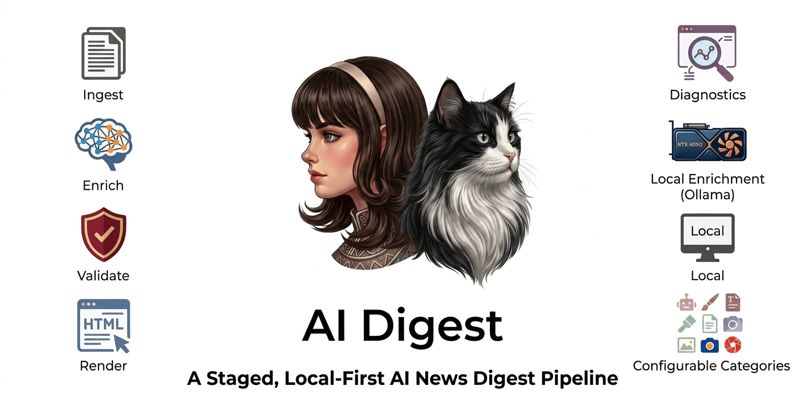
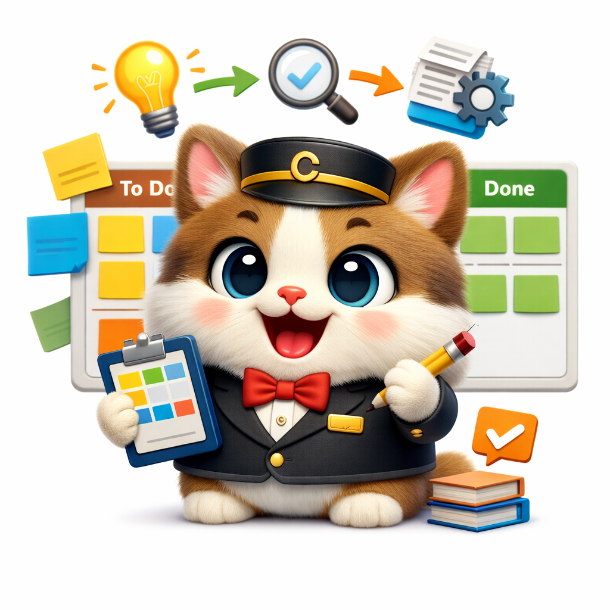
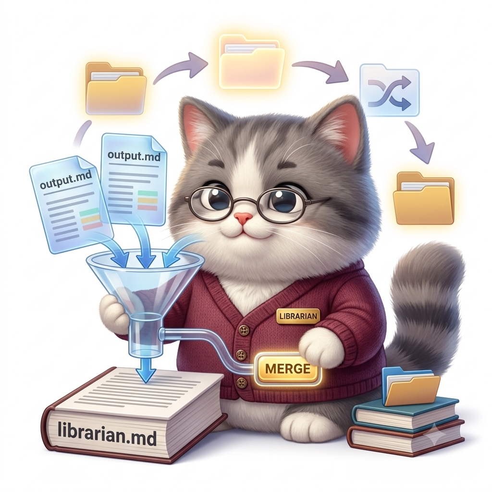
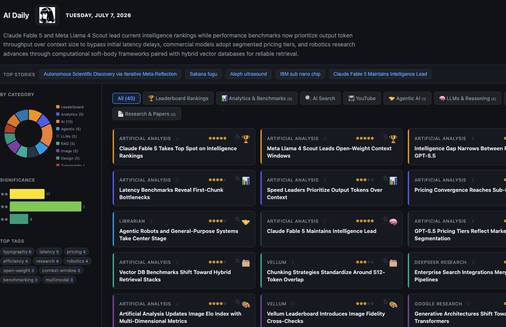
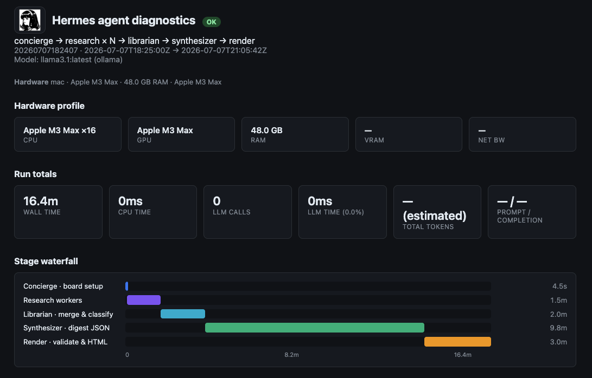
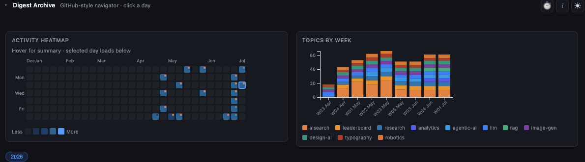
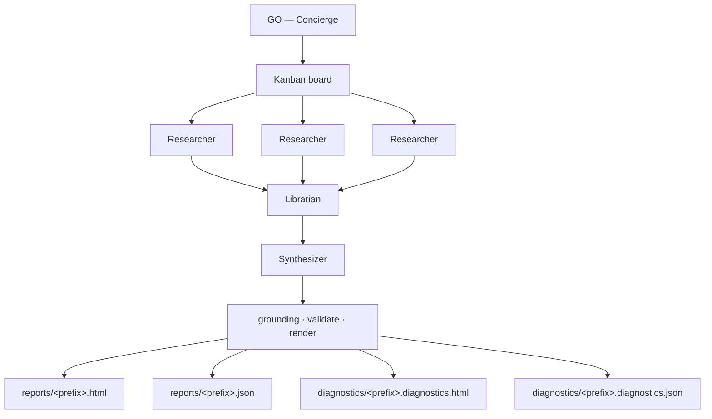
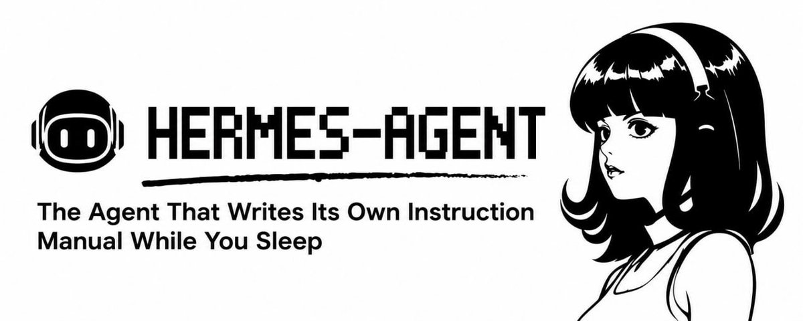

<p align="center">
  
</p>

<p align="center">
  
  <br>
  <strong>Showcase demo: ORIO — agentic architecture for a daily AI news digest</strong>
  <br>
  <em>Open Research Intelligence Observatory</em> · Hermes crew + Oreo mascot
  <br>
  <a href="https://mameen.github.io/AI_Digest/">Live site</a> ·
  <a href="agentic/hermes/docs/ARCHITECTURE.md">Architecture</a> ·
  <a href="agentic/hermes/POC.md">Run the POC</a>
</p>

---

Four roles. One digest. Each agent has a job — and a mascot.

## Current Direction (July 2026)

Multi-agent orchestration in Hermes is still a valid architecture for ORIO, but in practice it adds coordination latency, prompt overhead, and token cost. We are preparing a redesign toward a modern single-agent architecture with dynamic context loading and deterministic software boundaries, while preserving Hermes as a runnable reference.

<a id="four-roles-one-digest-each-agent-has-a-job--and-a-mascot"></a>

<table>
<tr>
<td align="center" width="25%">
  <br>
  <strong>Concierge</strong><br>
  <small>Your single point of contact.<br>
  Keeps the standing topic list and schedule; tells GO from “add a topic.”<br>
  Assembles the kanban board — never fetches sources or writes stories.</small><br>
  <small><a href="agentic/hermes/admin/config/souls/orio_concierge.md">SOUL</a> ·
  <a href="agentic/hermes/system_roles.md#concierge">Roles &amp; responsibilities</a></small>
</td>
<td align="center" width="25%">
  <br>
  <strong>Researcher</strong><br>
  <small>Parallel worker — one target per task<br>
  (category, feed cluster, or source bundle).<br>
  Fetches pages, extracts facts, returns structured notes with URLs.<br>
  Reflects and grounds its own artifact — downstream agents trust that work.<br>
  Does not merge across topics or write the digest.</small><br>
  <small><a href="agentic/hermes/admin/config/souls/orio_researcher.md">SOUL</a> ·
  <a href="agentic/hermes/system_roles.md#researcher">Roles &amp; responsibilities</a></small>
</td>
<td align="center" width="25%">
  <br>
  <strong>Librarian</strong><br>
  <small>Fan-in after all researchers finish.<br>
  Resolves overlap and maps every article/data point to topics.<br>
  Outputs a curated skeleton + knowledge graph — not final prose.<br>
  Synthesizer should not redo this curatorial work.</small><br>
  <small><a href="agentic/hermes/admin/config/souls/orio_librarian.md">SOUL</a> ·
  <a href="agentic/hermes/system_roles.md#librarian">Roles &amp; responsibilities</a></small>
</td>
<td align="center" width="25%">
  <br>
  <strong>Synthesizer</strong><br>
  <small>Reads the librarian skeleton — overlap and topic mapping are done.<br>
  Focuses on format, schema, and writing: takeaway, summary, narratives → digest JSON.<br>
  Does not re-fetch, reclassify, or resolve overlap; grounding runs downstream.</small><br>
  <small><a href="agentic/hermes/admin/config/souls/orio_synthesizer.md">SOUL</a> ·
  <a href="agentic/hermes/system_roles.md#synthesizer">Roles &amp; responsibilities</a></small>
</td>
</tr>
</table>

**AI Digest** (codename **ORIO** — *Open Research Intelligence Observatory*) turns noisy AI news into a polished daily briefing — HTML archive, heatmaps, leaderboards, and per-run diagnostics. Hermes profiles use `orio_*` code names. **Default GO** (`manage.py go` / Concierge `digest_go`) runs the four-role kanban graph above, then deterministic grounding and render. The old batch CLI (`run.py`) remains as a **`--pipeline` escape hatch** only. Deterministic code verifies every link before anything publishes.

Built on [**Hermes Agent**](https://hermes-agent.nousresearch.com/) (Nous Research). Local LLMs via [Ollama](https://ollama.com/) — no cloud API keys. Every story traceable to its source.

### How it evolved

It started as a **Claude skill** — a simple daily briefing prompt. That worked until
the gaps showed up: some sources need dedicated tooling, not just a longer prompt.
YouTube chapters, leaderboard crawls, and structured API fetches each wanted their
own extractors, not improvisation in chat.

That pushed the project into a **staged LLM pipeline** (`llm_pipeline/`) — ingest,
enrich, validate, render — which proved the digest format and grounding model.
At scale, though, sequential runs became hard to **debug and extend**: one long
batch job, opaque failures, and every new source meant more pipeline wiring.

The **agentic** cutover replaced the opaque batch job with a **four-role crew**
on Hermes kanban: Concierge assembles the board; researchers work in parallel;
Librarian fan-in; Synthesizer composes; deterministic grounding still has the
last word on links and provenance. The staged batch CLI (`llm_pipeline/` +
`run.py`) proved the digest format first — it remains as shared libraries and a
`--pipeline` escape hatch while batch orchestration is deprecated.

What you see in this repo — `agentic/hermes/` — is a **bootstrap snapshot**: enough
to reproduce the architecture, run E2E locally, and publish showcase reports to
GitHub Pages. The **production system** now lives and runs on my server; this
repository is the reference implementation and portfolio demo.

→ Early pipeline exploration: [`docs/LLM_PIPELINE.md`](docs/LLM_PIPELINE.md)

<p align="center">
  <a href="https://mameen.github.io/AI_Digest/reports/20260707182407.html">
    
  </a>
  <br><sub>Daily digest — categories, leaderboards, charts, provenance on every story</sub>
</p>

<p align="center">
  <a href="https://mameen.github.io/AI_Digest/diagnostics/20260707182407.diagnostics.html">
    
  </a>
  <br><sub>Agent diagnostics — kanban crew waterfall (research → librarian → synthesizer → render)</sub>
</p>

<p align="center">
  <a href="https://mameen.github.io/AI_Digest/index/index.html">
    
  </a>
  <br><sub>Archive analytics — activity heatmap and topic trends across runs</sub>
</p>

---

## ORIO workflow (source of truth)

> **Do not change this graph, role split, or four-output contract without explicit
> maintainer approval.** The diagram below matches
> [`agentic/hermes/docs/ARCHITECTURE.md`](agentic/hermes/docs/ARCHITECTURE.md) — keep
> them in sync.

### Production end-to-end flow (default GO)



**What happens on GO:**

1. **Concierge** kicks off the run (`digest_go` / `manage.py go`) and assembles the
   kanban board — one **Researcher** task per topic (default: categories from the
   best known-good report; override via `demo_topics` in yaml).
2. **Ingest warm-up** (deterministic) fills `.preflight/` and `.cache/<prefix>/`.
3. **Researcher × N** work in parallel — one topic each → `output.md` per task.
   Each researcher reflects and grounds its own artifact; downstream roles trust that work.
4. **Librarian** waits for all researchers — **resolves overlap**, maps articles
   and data points to standing topics, dedupes/regroups → `librarian.md`.
5. **Synthesizer** reads that skeleton — format, schema, and prose → `digest.json`.
6. **Grounding · validate · render** — deterministic pipeline (not agent roles) → four files below.
7. **Diagnostics** waterfall written for the run.

**Four published files** (example prefix `20260709120000`):

| File | Path |
|------|------|
| Report HTML | `agentic/hermes/reports/<prefix>.html` |
| Report JSON | `agentic/hermes/reports/<prefix>.json` |
| Diagnostics HTML | `agentic/hermes/diagnostics/<prefix>.diagnostics.html` |
| Diagnostics JSON | `agentic/hermes/diagnostics/<prefix>.diagnostics.json` |

| Layer | What happens |
|-------|----------------|
| **Orchestration** | Concierge kanban — research × N → librarian → synthesizer |
| **Concierge control plane** | GO, board status/abort, assess, `digest_open_report`, deploy, publish (push only after you approve) |
| **Board topics** | Auto from **best known-good report** (most stories); override via `demo_topics` in yaml |
| **Ingest** | Warm cache (preflight, Crawl4AI, structured APIs) before researchers run |
| **Workers** | Hermes LLM profiles with artifact gates per role |
| **Invariants** | `grounding.py` + `validate.py` — deterministic, not agent-judged |
| **Output** | Four files above + archive index updates on publish |

**Batch escape hatch** (`go --pipeline`): same `enrich_digest` as `run.py` — debug/A/B
only. Skips kanban workers entirely.

Agents propose; the pipeline disposes. Links, categories, and provenance tokens are
stamped by deterministic code — never trusted from model output alone.

### Where to read — role details (who does what)

| What you want | Where to read |
|---------------|---------------|
| **Full role definitions** — purpose, responsibilities, tools, what each profile must *not* do | [`agentic/hermes/system_roles.md`](agentic/hermes/system_roles.md) |
| **Artifact shapes & handoffs** — `output.md`, `librarian.md`, `digest.json`, gates | [`agentic/hermes/working_agreements.md`](agentic/hermes/working_agreements.md) |
| **Concierge control plane** (GO, status, publish) | [`agentic/hermes/admin/config/souls/orio_concierge.md`](agentic/hermes/admin/config/souls/orio_concierge.md) |
| **Worker behavior in kanban** | SOUL files: [`orio_researcher.md`](agentic/hermes/admin/config/souls/orio_researcher.md), [`orio_librarian.md`](agentic/hermes/admin/config/souls/orio_librarian.md), [`orio_synthesizer.md`](agentic/hermes/admin/config/souls/orio_synthesizer.md) |
| **Showcase one-liner per role** (mascot table) | This file — [four roles](#four-roles-one-digest-each-agent-has-a-job--and-a-mascot) above |

**Split:** `system_roles.md` = **who** and orchestration.
`working_agreements.md` = **what** each role produces and which tools it may call.

### Where to read — flow chart & runbook

| What you want | Where to read |
|---------------|---------------|
| **High-level agent flow** (this page) | [Production end-to-end flow](#production-end-to-end-flow-default-go) above |
| **Detailed E2E** — numbered steps, ingest, kanban artifacts, approved design | [`agentic/hermes/docs/ARCHITECTURE.md`](agentic/hermes/docs/ARCHITECTURE.md) |
| **How to run it** | [`agentic/hermes/POC.md`](agentic/hermes/POC.md) |
| **Admin commands + digest-tools** | [`agentic/hermes/admin/README.md`](agentic/hermes/admin/README.md) |

**Fastest path:** this README (story + diagram) →
[`system_roles.md`](agentic/hermes/system_roles.md) (each profile) →
[`ARCHITECTURE.md`](agentic/hermes/docs/ARCHITECTURE.md) (full pipeline + paths).

### Quick commands

```bash
# Bootstrap (once)
python agentic/hermes/admin/manage.py bootstrap

# Full production run (agentic kanban — default)
python agentic/hermes/admin/manage.py go --start 2026-07-09 --history 10 --fresh

# Batch run.py parity (escape hatch only)
python agentic/hermes/admin/manage.py go --pipeline --start 2026-07-09

# Diagnostics waterfall for a run
python agentic/hermes/admin/manage.py diagnostics --prefix 20260707182407

# Publish to GitHub Pages
python scripts/deploy_app.py --agentic-hermes --one-day 20260707182407 --not-dry-run
```

Tests: `python run_tests.py` — real fixtures, no mocks (see [AGENTS.md](AGENTS.md)).

---

## Documentation canon

**Single source of truth:** this file ([`README.md`](README.md)) — especially
[ORIO workflow](#orio-workflow-source-of-truth) (diagram, four outputs, role split).

Everything under [`agentic/hermes/`](agentic/hermes/) extends it. If anything conflicts,
**README wins**. Legacy staged-pipeline notes live under [`docs/LLM_PIPELINE.md`](docs/LLM_PIPELINE.md)
and `llm_pipeline/` — not the product story.

## More docs

| Topic | Doc |
|-------|-----|
| **Slack front desk** | [`agentic/hermes/slack.md`](agentic/hermes/slack.md) |
| **Early staged pipeline (legacy)** | [`docs/LLM_PIPELINE.md`](docs/LLM_PIPELINE.md) |
| **Agent onboarding (contributors)** | [`.agents/onboarding/`](.agents/onboarding/) |

Role, workflow, and architecture pointers are in [Where to read](#where-to-read--role-details-who-does-what) above.

### Hermes profiles

Each role maps to a profile in the [Hermes dashboard](https://hermes-agent.nousresearch.com/) — seeded from [`hermes_roles.yaml`](agentic/hermes/admin/config/hermes_roles.yaml) via `manage.py setup`. Production runs on a dedicated server; the repo holds the bootstrap config.

<p align="center">
  
</p>

---

## Acknowledgments

**Author:** [Ameen Demiry](https://www.linkedin.com/in/ademiry/) · [Portfolio](https://demiry.net/) · [GitHub](https://github.com/mameen/AI_Digest)

**Editorial inspiration:** the daily briefing format is inspired by
[**theAIsearch**](https://www.youtube.com/@TheAiSearch) — adapted here as a
local-first, agentic, auditable pipeline rather than a broadcast show.

**Agent platform:** [**Hermes Agent**](https://hermes-agent.nousresearch.com/) by
[Nous Research](https://nousresearch.com) — kanban orchestration, profiles, and
tooling that this digest builds on.
[Docs](https://hermes-agent.nousresearch.com/) ·
[GitHub](https://github.com/NousResearch/hermes-agent)

<p align="center">
  <a href="https://github.com/NousResearch/hermes-agent">
    
  </a>
</p>

Role mascots (Concierge, Researcher, Librarian, Synthesizer) are original artwork
for this project. The AI Digest logo and banner are © Ameen Demiry.

---

## Third-party software

AI Digest is released under the [MIT License](LICENSE). It depends on and
integrates the following open-source projects. Each retains its own license;
see the linked project for full terms and attribution requirements.

| Project | Role in AI Digest | License |
|---------|-------------------|---------|
| [Hermes Agent](https://github.com/NousResearch/hermes-agent) | Agent orchestration (kanban, profiles, CLI) | See upstream repo |
| [Ollama](https://ollama.com/) | Local LLM inference | See upstream |
| [Instructor](https://github.com/jxnl/instructor) | Structured LLM output (Pydantic) | MIT |
| [OpenAI Python SDK](https://github.com/openai/openai-python) | Ollama-compatible API client | Apache-2.0 |
| [Pydantic](https://github.com/pydantic/pydantic) | Schema validation | MIT |
| [PyYAML](https://github.com/yaml/pyyaml) | Configuration | MIT |
| [Crawl4AI](https://github.com/unclecode/crawl4ai) | JS-rendered page crawl (leaderboards) | See upstream repo |
| [Playwright](https://github.com/microsoft/playwright) | Browser automation (Crawl4AI) | Apache-2.0 |
| [yt-dlp](https://github.com/yt-dlp/yt-dlp) | YouTube chapter extraction | Unlicense |
| [D3.js](https://github.com/d3/d3) | Archive heatmaps & trend charts (CDN) | ISC |

Pinned Python versions: [`requirements-lock.txt`](requirements-lock.txt).

Redistribution of this software must retain the MIT copyright notice in
[`LICENSE`](LICENSE) and comply with the licenses of bundled third-party
components listed above.

---

<p align="center">
  <strong>AI Digest</strong> · MIT License ·
  <a href="https://www.linkedin.com/in/ademiry/">Ameen Demiry</a>
</p>
