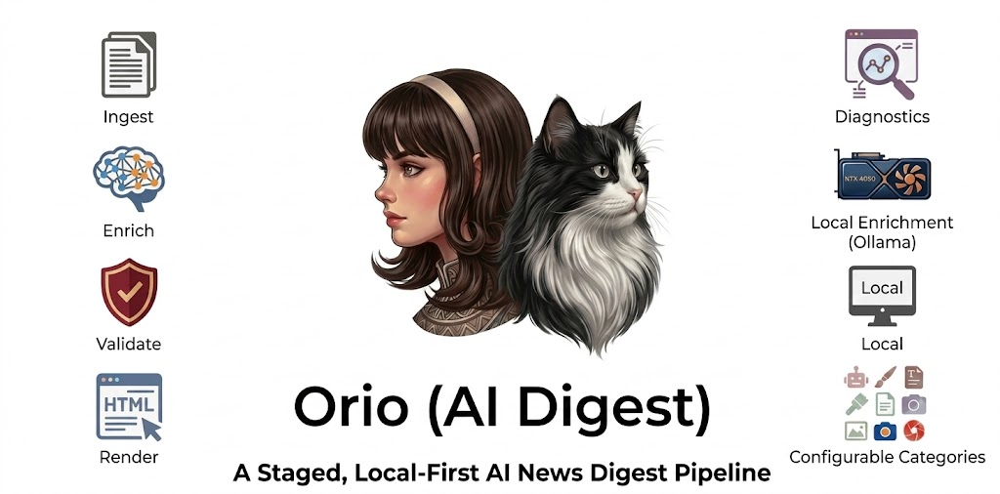

# AI Digest

Local-first AI news digest experiments by **Ameen Demiry**.

AI Digest explores one product idea through four proof-of-concept tracks: turn noisy AI news, videos, benchmarks, and research signals into a structured daily briefing with source provenance, validation, diagnostics, and a polished HTML archive.

<p align="center">
  
</p>

## The Four POCs

| POC | Folder | What it proves | Status |
|---|---|---|---|
| **1. LLM Pipeline** | [`llm_pipeline/`](llm_pipeline/) | Deterministic ingest, enrichment, validation, and report rendering. | Stable baseline |
| **2. Hermes Multi-Agent** | [`agentic/hermes/`](agentic/hermes/) | Four-role kanban crew: Concierge, Researcher, Librarian, Synthesizer. | Reference implementation |
| **3. Kaggle AI Agents** | [`agentic/kaggle_ai_agents/`](agentic/kaggle_ai_agents/) | Course/capstone sandbox for skills, tool use, security gates, and evaluation. | Standalone POC |
| **4. Single Agent + Skills** | [`agentic/single_hermes_agent/`](agentic/single_hermes_agent/) | Target direction: one host agent with progressively loaded skills. | Design stub |

## What This Project Demonstrates

1. **Auditable AI output:** every digest story carries source metadata and passes deterministic grounding checks before publishing.
2. **Local-first execution:** the main experiments are designed around local Python, Ollama-compatible LLM calls, and committed fixtures where possible.
3. **Multiple agent architectures:** the repo compares a staged batch pipeline, a multi-agent kanban crew, and a simpler single-agent-with-skills direction.
4. **Portfolio-grade reporting:** generated HTML reports include story cards, categories, provenance, leaderboards, archive pages, and diagnostics.

## Website Content

[`app/`](app/) is the approved website payload for [mameen.github.io/AI_Digest](https://mameen.github.io/AI_Digest). Treat those reports and diagnostics as canonical published artifacts.

| Artifact | Path |
|---|---|
| Website index | [`app/index.html`](app/index.html) |
| Approved report index | [`app/reports/index.json`](app/reports/index.json) |
| Approved diagnostics index | [`app/diagnostics/index.json`](app/diagnostics/index.json) |
| Latest approved report | [`app/reports/20260728120000.html`](app/reports/20260728120000.html) |
| Latest approved diagnostics | [`app/diagnostics/20260728120000.diagnostics.html`](app/diagnostics/20260728120000.diagnostics.html) |

Source POC folders may contain development outputs. When archiving, prefer `app/` as the truth for what was approved and published.

## Quick Start

```powershell
# Bootstrap dependencies
python admin/manage.py bootstrap

# Run the stable pipeline baseline
python run.py --start 2026-07-29 --history 10

# Run tests
python run_tests.py
```

Hermes requires a local Hermes/Ollama setup:

```powershell
python agentic/hermes/admin/manage.py bootstrap
python agentic/hermes/admin/manage.py go --start 2026-07-09 --history 10 --fresh
```

Kaggle POC commands live in [`agentic/kaggle_ai_agents/HOWTO.md`](agentic/kaggle_ai_agents/HOWTO.md).

## Repo Skills

[`SKILLS/`](SKILLS/) contains repo-assistant skills for contributors and coding agents. These are not product/runtime skills. Runtime skill experiments live under [`agentic/`](agentic/), especially [`agentic/single_hermes_agent/`](agentic/single_hermes_agent/).

## Documentation

| Topic | Read |
|---|---|
| Documentation index | [`docs/README.md`](docs/README.md) |
| Contributor/agent rules | [`AGENTS.md`](AGENTS.md) |
| Agentic POCs | [`agentic/README.md`](agentic/README.md) |
| Shared library notes | [`lib/README.md`](lib/README.md) |
| Pipeline POC | [`llm_pipeline/README.md`](llm_pipeline/README.md) |
| Hermes POC | [`agentic/hermes/README.md`](agentic/hermes/README.md) |
| Kaggle POC | [`agentic/kaggle_ai_agents/README.md`](agentic/kaggle_ai_agents/README.md) |
| Single-agent design | [`agentic/single_hermes_agent/docs/ideation.md`](agentic/single_hermes_agent/docs/ideation.md) |

## Attribution

Author: [Ameen Demiry](https://www.linkedin.com/in/ademiry/)
Portfolio: [demiry.net](https://demiry.net/)
GitHub: [mameen/AI_Digest](https://github.com/mameen/AI_Digest)

AI Digest is released under the [MIT License](LICENSE). Third-party dependencies retain their own licenses; see the dependency files and bundled notices where applicable.
