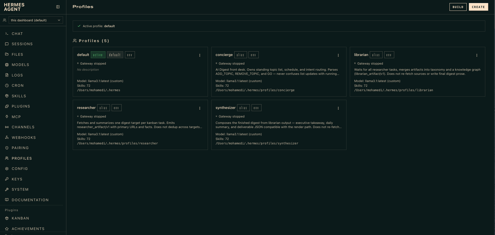

# Proof-of-concept — agentic AI Digest

> **Canonical narrative:** [`README.md`](../../README.md) at the repo root — **if this
> doc conflicts with README, README wins.**

> **Showcase:** crew mascots, evolution story, screenshots — see root README.

**Production GO:** four-role kanban crew (`manage.py go`). Batch escape hatch only: `go --pipeline`.

```bash
python agentic/hermes/admin/manage.py go --start 2026-07-09 --history 10 --fresh
```

Opens `agentic/hermes/reports/<prefix>.html` after kanban crew + deterministic render.
Topic count follows the **best known-good report** (unless `demo_topics` pinned).

Prereqs (once): `python agentic/hermes/admin/manage.py bootstrap` and Ollama running.

---

Step-by-step to **validate the agentic stack** using upstream Hermes.

| Phase | Proves | Time | Status |
|---|---|---|---|
| [1. Dashboard chat](#phase-1-hermes-dashboard-chat) | Local Ollama + agent + tools in UI | ~15 min | **Do this first** |
| [2. Kanban fan-out](#phase-2-kanban-parallel-demo) | Parallel roles + synthesizer | ~1 hr | **Default `go`** |
| [3. Slack](#phase-3-slack-optional) | Concierge front desk in chat | ~30 min | See [`slack.md`](slack.md) |
| [4. Digest integration](#phase-4-digest-via-go) | Kanban GO → `reports/*.html` | varies | **Default `go`** |

---

## Why this isn't the YouTube walkthrough

The [Hermes parallel-agents video](https://www.youtube.com/watch?v=1MaFErWfL24)
runs on a VPS with larger models. AI Digest adds grounding, validation, and a
12-category render path. On a MacBook (M3), use **`llama3.1:latest`** (~5 GB, 128K ctx)
with **`kanban.max_in_progress 1`** and expect workers to take time — researchers
lazy-fetch per tool (`read_topic_config`, `read_preflight_category`, …); no central
warm step at `go`.

---

## What you can test today

**Yes — use the Hermes dashboard chat.** That is the fastest proof that your
stack (Ollama, Hermes, tools) works before wiring AI Digest.

```bash
python admin/manage.py bootstrap                    # pipeline .venv + doctor
python agentic/hermes/admin/manage.py bootstrap     # agentic .runtime + setup
python agentic/hermes/admin/manage.py hermes dashboard
```

<p align="center">
  
  <br><sub>Profiles created by <code>manage.py setup</code> — <code>orio_concierge</code>, <code>orio_researcher</code>, <code>orio_librarian</code>, <code>orio_synthesizer</code> (Concierge, Researcher, Librarian, Synthesizer)</sub>
</p>

`setup` creates the ORIO crew from
[`admin/config/hermes_roles.yaml`](admin/config/hermes_roles.yaml). Re-run:

```bash
python agentic/hermes/admin/manage.py setup
```

You can also chat: `hermes chat` or `python agentic/hermes/admin/manage.py hermes chat`.

---

## What is not integrated yet

| Piece | State |
|---|---|
| In-repo `run_hermes.py` | Not implemented |
| Concierge / Researcher / Librarian profiles in this repo | Implemented — [`system_roles.md`](system_roles.md), `orio_*` in [`hermes_roles.yaml`](admin/config/hermes_roles.yaml) |
| Task board in `agentic/hermes/.runtime/` | Empty dir |
| A/B vs `llm_pipeline` | Stub [`tools/baseline.py`](tools/baseline.py) |
| Digest JSON from agentic run | **`go`** (kanban crew) → `reports/*.html` |
| Batch A/B vs `run.py` | **`go --pipeline`** via [`tools/pipeline_go.py`](tools/pipeline_go.py) |

Phase 1–3 prove **Hermes + Ollama + (optional) kanban/Slack**. Phase 4 is
**default `manage.py go`** — the four-role kanban graph. Batch escape hatch:
`go --pipeline`.

---

## Phase 1: Hermes dashboard chat

**Goal:** Send a message in Hermes UI, get a local-model reply, confirm doctor green.

### 1.1 Repo bootstrap (once)

```bash
python admin/manage.py bootstrap
python admin/manage.py status    # should show ✓ uv if installed
```

Uses **uv** when on PATH (`uv venv` + `uv pip install`); falls back to stdlib venv + pip.
If `.venv` is broken (e.g. repo moved), run `bootstrap --recreate-venv`.

Ensure Ollama is running and serves the model you expect (default `llama3.1:latest` on laptop; showcase `qwen3.6:35b`):

```bash
ollama list
curl -s http://localhost:11434/v1/models | head
```

### 1.2 Hermes → Ollama

Handled by `python agentic/hermes/admin/manage.py setup` (reads `config.yaml` +
`admin/config/hermes_roles.yaml`). To re-apply:

```bash
python agentic/hermes/admin/manage.py setup
```

Verify:

```bash
python agentic/hermes/admin/manage.py hermes doctor
python agentic/hermes/admin/manage.py hermes profile list
```

Interactive alternative (first-time Hermes install only):

```bash
python agentic/hermes/admin/manage.py hermes setup model
```

### 1.3 Open dashboard + chat

```bash
python agentic/hermes/admin/manage.py hermes dashboard
```

In the browser:

1. **Profile switcher** (sidebar) — use `default` unless you created profiles.
2. **Chat** tab — type a simple prompt, e.g. *“Summarize what Socket Mode means in one sentence.”*
3. Confirm streaming reply from local model.

**Pass criteria:** message in → assistant message out, no auth/API key errors.

Terminal alternative (same backend):

```bash
python agentic/hermes/admin/manage.py hermes chat -q "Hello — are you using Ollama?"
```

### 1.4 Optional: one tool call

In dashboard chat, ask something that triggers a built-in tool, e.g. *“What time is it?”* or a small file read if terminal tools are enabled.

**Pass criteria:** agent uses a tool (visible in UI trace) or explains if tools disabled.

---

## Phase 2: Kanban parallel demo

**Goal:** Prove the **AI Digest** task graph on Hermes kanban.

Board topics default to the **best known-good report** (most stories). Override by
pinning `demo_topics` in `hermes_roles.yaml` — same `orio_researcher` profile, more tasks.

```
research × N  →  librarian (merge/classify)  →  synthesizer
```

Not the shortened Hermes walkthrough (research → synthesizer only).

### 2.1 Enable kanban toolset

Done by `python agentic/hermes/admin/manage.py setup`. Gateway for dispatch:

```bash
hermes gateway start
hermes config set kanban.max_in_progress 1   # laptop
```

### 2.2 Create profiles (roles, not subjects)

Done by `setup`. Verify:

```bash
python agentic/hermes/admin/manage.py hermes profile list
```

### 2.3 Create the board and run

```bash
python agentic/hermes/admin/manage.py demo-board
hermes kanban list
hermes kanban dispatch --max 1
```

Watch in **Kanban** (web dashboard) or `hermes kanban list`.

**Pass criteria:** researchers complete → librarian promotes → librarian completes → synthesizer runs.

---

## Phase 3: Slack (optional)

**Goal:** Concierge-style chat from Slack instead of dashboard.

1. Complete [`slack.md`](slack.md) (or scratch [`slack_deleteme.md`](slack_deleteme.md)).
2. Copy [`config/hermes.env.example`](config/hermes.env.example) → `~/.hermes/.env`, fill tokens.
3. Dashboard → **Messaging → Slack** → paste same values → save.
4. `python agentic/hermes/admin/manage.py hermes gateway start`
5. DM or @mention the bot.

**Pass criteria:** Slack message → Hermes reply (same agent stack as Phase 1).

---

## Phase 4: Digest via GO (production — default)

**Goal:** Produce a validated digest HTML via the four-role kanban crew.

```bash
python agentic/hermes/admin/manage.py go --start 2026-07-09 --history 10 --fresh
```

**Pass criteria:** `agentic/hermes/reports/<prefix>.html` exists, 12 categories,
validation OK, artifact gates passed per role (`digest_board_status`).

Batch escape hatch only (debug/A/B):

```bash
python agentic/hermes/admin/manage.py go --pipeline --start 2026-07-09 --history 10
```

---

## Quick decision tree

```
Want to proof agents + Ollama work?
  → Phase 1: hermes dashboard → Chat

Want to proof parallel fan-out / fan-in?
  → Phase 2: demo-board + kanban dispatch

Want to proof chat from Slack?
  → Phase 3: slack.md

Want production digest HTML?
  → python agentic/hermes/admin/manage.py go --start YYYY-MM-DD --fresh
  (four-role kanban — default; NOT run.py)
```

---

## E2E test runbook

### Phase 0 — Offline gates (no LLM, no network)

```bash
python -m unittest tests.test_board_topics tests.test_pipeline_go -v
python run_tests.py
```

### Phase 1 — Production GO (kanban)

```bash
python agentic/hermes/admin/manage.py go --start 2026-07-09 --fresh --skip-doctor
```

Requires Hermes gateway + worker profiles. Expect artifact gates per role in
`digest_board_status`.

### Phase 2 — Eval fixtures (optional)

Pin `demo_topics: [evaluation_test_topic]` in `hermes_roles.yaml`, then:

```bash
python agentic/hermes/admin/manage.py go --fresh --prefix eval$(date -u +%Y%m%d%H%M%S)
```

### Phase 3 — Batch parity (optional, escape hatch)

```bash
python agentic/hermes/admin/manage.py go --pipeline --start 2026-07-09 --skip-doctor
```

Diagnostics rebuild: `python agentic/hermes/admin/manage.py diagnostics --prefix <prefix>`

---

## Related

- [`slack.md`](slack.md) — Slack credentials + gateway + config templates
- [`admin/README.md`](admin/README.md) — `manage.py` + digest-tools
- [`docs/ARCHITECTURE.md`](docs/ARCHITECTURE.md) — approved design
- [Hermes dashboard docs](https://hermes-agent.nousresearch.com/docs/user-guide/profiles) — profile switcher, chat follows selection
