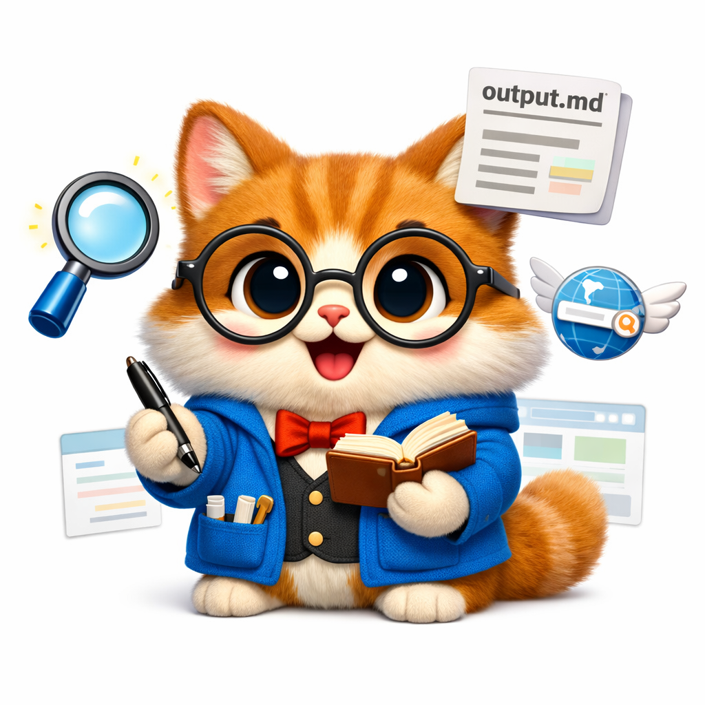
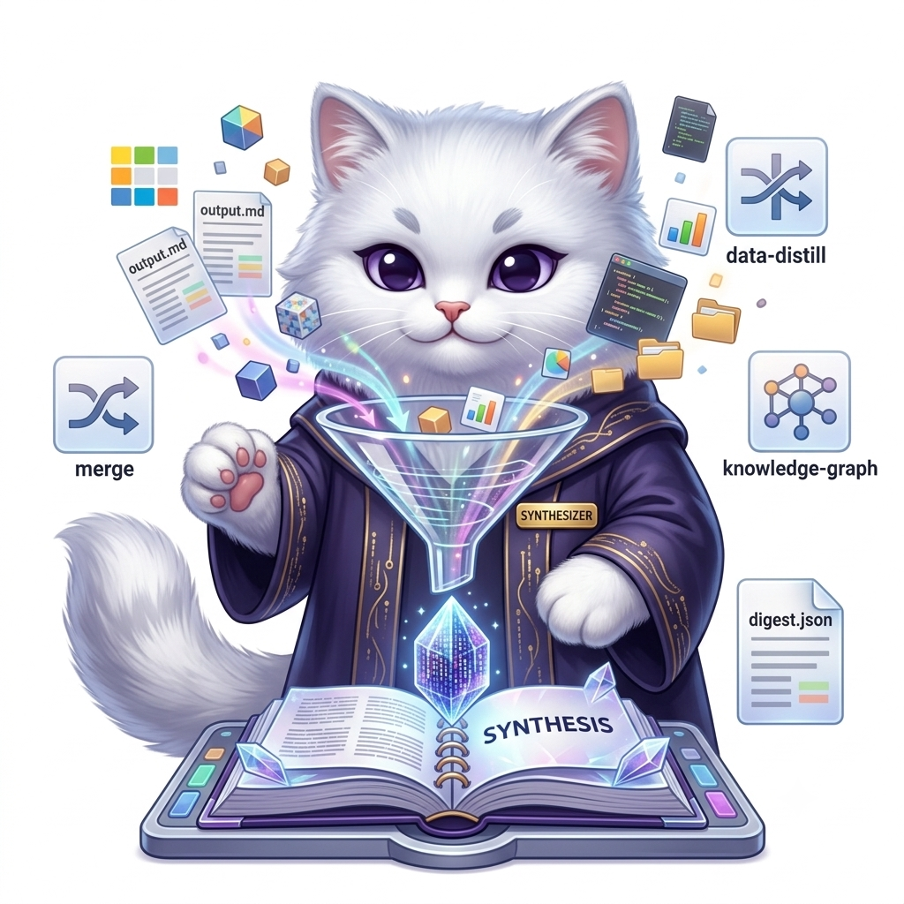
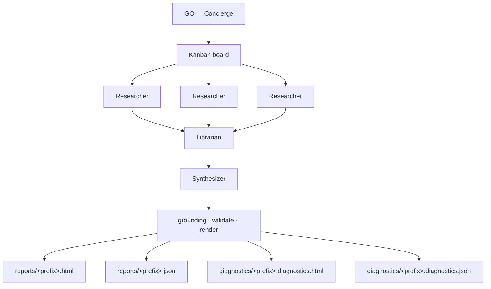

# ORIO — Open Research Intelligence Observatory (`agentic/hermes/`)

This directory contains the **agentic orchestration product** for AI Digest (codename **ORIO**). It is built on the [Nous Research Hermes Agent](https://hermes-agent.nousresearch.com/) platform and designed to run using local LLMs (via Ollama) without requiring cloud API keys.

Four roles. One digest. Each agent has a job:

<table>
<tr>
<td align="center" width="25%">
  <br>
  <strong>Concierge</strong><br>
  <small>Your single point of contact.<br>
  Keeps the standing topic list and schedule; tells GO from "add a topic."<br>
  Assembles the kanban board — never fetches sources or writes stories.</small><br>
  <small><a href="admin/config/souls/orio_concierge.md">SOUL</a> ·
  <a href="system_roles.md#concierge">Roles &amp; responsibilities</a></small>
</td>
<td align="center" width="25%">
  <br>
  <strong>Researcher</strong><br>
  <small>Parallel worker — one target per task<br>
  (category, feed cluster, or source bundle).<br>
  Fetches pages, extracts facts, returns structured notes with URLs.<br>
  Reflects and grounds its own artifact — downstream agents trust that work.<br>
  Does not merge across topics or write the digest.</small><br>
  <small><a href="admin/config/souls/orio_researcher.md">SOUL</a> ·
  <a href="system_roles.md#researcher">Roles &amp; responsibilities</a></small>
</td>
<td align="center" width="25%">
  <br>
  <strong>Librarian</strong><br>
  <small>Fan-in after all researchers finish.<br>
  Resolves overlap and maps every article/data point to topics.<br>
  Outputs a curated skeleton + knowledge graph — not final prose.<br>
  Synthesizer should not redo this curatorial work.</small><br>
  <small><a href="admin/config/souls/orio_librarian.md">SOUL</a> ·
  <a href="system_roles.md#librarian">Roles &amp; responsibilities</a></small>
</td>
<td align="center" width="25%">
  <br>
  <strong>Synthesizer</strong><br>
  <small>Reads the librarian skeleton — overlap and topic mapping are done.<br>
  Focuses on format, schema, and writing: takeaway, summary, narratives → digest JSON.<br>
  Does not re-fetch, reclassify, or resolve overlap; grounding runs downstream.</small><br>
  <small><a href="admin/config/souls/orio_synthesizer.md">SOUL</a> ·
  <a href="system_roles.md#synthesizer">Roles &amp; responsibilities</a></small>
</td>
</tr>
</table>

---

## ORIO Workflow

The flow below represents the production end-to-end run (triggered by `manage.py go` or the Concierge's `digest_go` command):



### What happens on GO:
1. **Concierge** kicks off the run (`manage.py go`) and assembles the kanban board — one **Researcher** task per topic.
2. **Ingest warm-up** (deterministic) fills `.preflight/` and `.cache/<prefix>/`.
3. **Researcher × N** work in parallel — one topic each → `output.md` per task. Each researcher reflects and grounds its own artifact; downstream roles trust that work.
4. **Librarian** waits for all researchers — **resolves overlap**, maps articles and data points to standing topics, dedupes/regroups → `librarian.md`.
5. **Synthesizer** reads that skeleton — format, schema, and prose → `digest.json`.
6. **Grounding · validate · render** — deterministic pipeline (not agent roles) → writes the final report and diagnostics.

---

## Quick Commands

```bash
# Bootstrap (once)
python agentic/hermes/admin/manage.py bootstrap

# Full production run (agentic kanban — default)
python agentic/hermes/admin/manage.py go --start 2026-07-09 --history 10 --fresh

# Batch run.py parity (escape hatch only)
python agentic/hermes/admin/manage.py go --pipeline --start 2026-07-09

# Diagnostics waterfall for a run
python agentic/hermes/admin/manage.py diagnostics --prefix 20260707182407
```

---

## Documentation Index

| Topic | Document |
| :--- | :--- |
| **High-level E2E Flow** | [docs/ARCHITECTURE.md](docs/ARCHITECTURE.md) |
| **Worker Invariants & Tooling Agreements** | [working_agreements.md](working_agreements.md) |
| **System Roles & Multi-Agent Structure** | [system_roles.md](system_roles.md) |
| **Bootstrap & Testing POC Runbook** | [POC.md](POC.md) |
| **Slack Front Desk Integration** | [slack.md](slack.md) |
