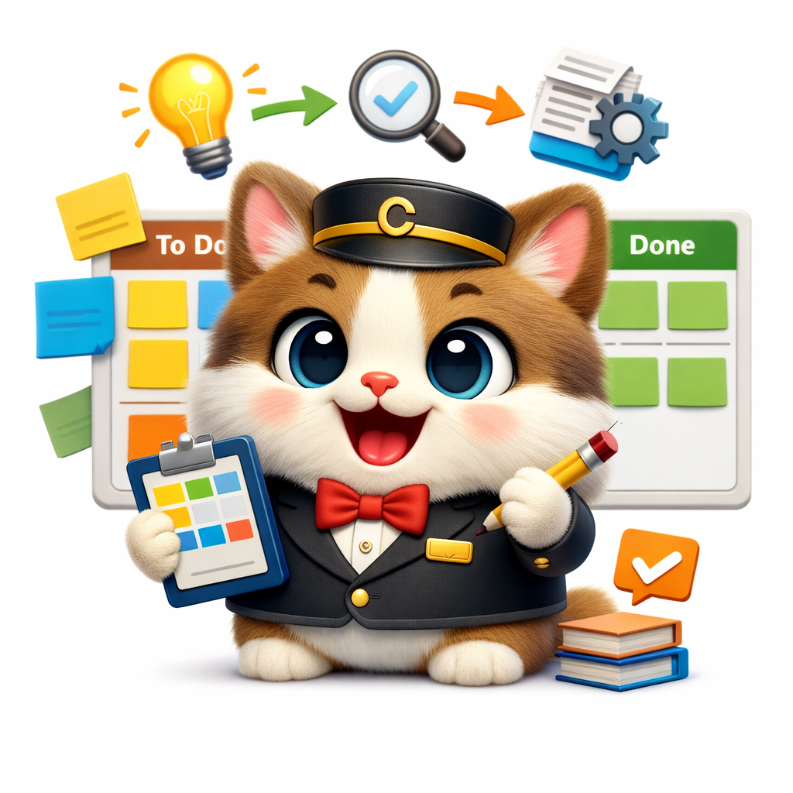
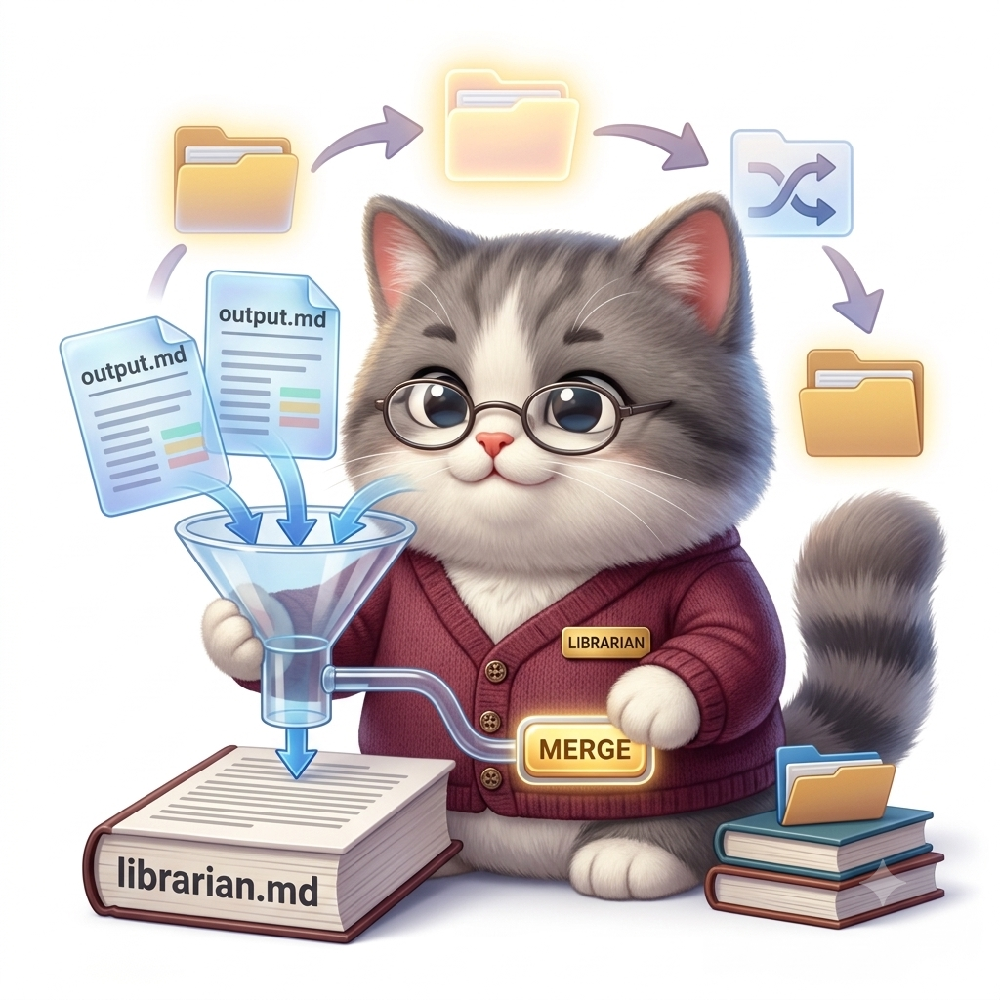
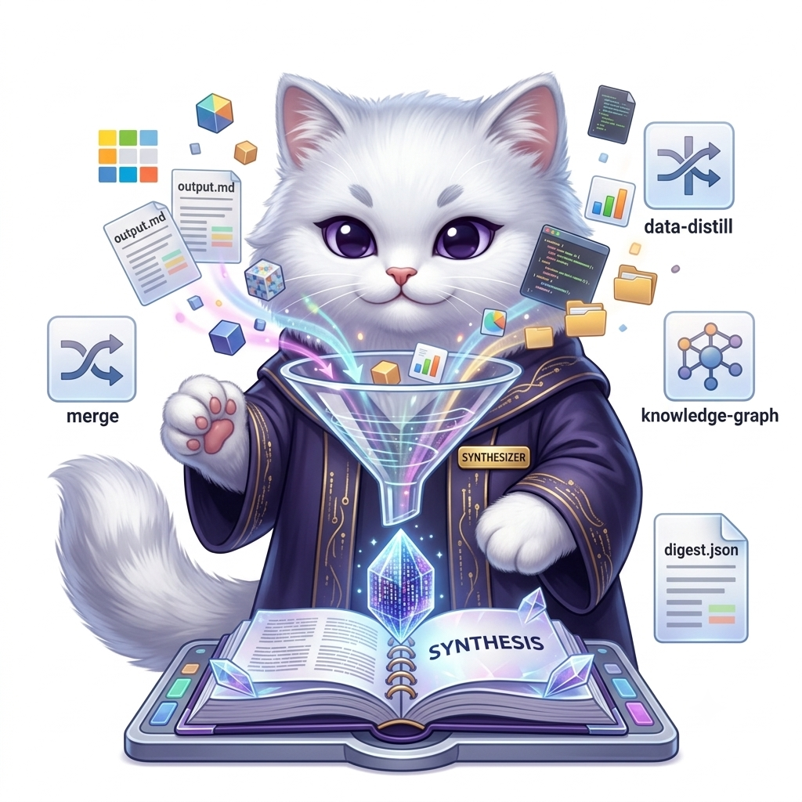
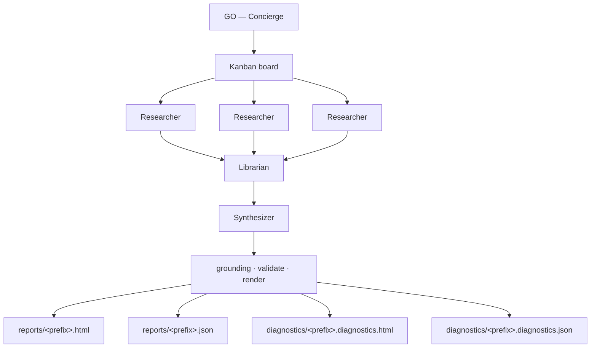

# ORIO — Open Research Intelligence Observatory (`agentic/hermes/`)

This directory contains the **agentic orchestration product** for AI Digest (codename **ORIO**). It is built on the [Nous Research Hermes Agent](https://hermes-agent.nousresearch.com/) platform and designed to run using local LLMs (via Ollama, standardized on **`qwen3.6:35b`**) without requiring cloud API keys.

> ⚠️ **Runtime Status & Governing Policy (ADR-002):** > `agentic/hermes/` represents the **Track 3 Multi-Agent Kanban experimental runtime**. Per **ADR-002**, Track 3 is maintained as an active bounded benchmark to evaluate multi-agent performance against strict parity gates ($\ge 55$ stories, $11/11$ categories, $\le 5\%$ provenance gap vs batch baseline). It is **not** the default production fallback.

---

## 4-Role Architecture (Async Waterfall DAG)

ORIO divides intelligence across four distinct roles running over an **Async Waterfall DAG (Directed Acyclic Graph)** execution schedule. I/O-bound web fetching and source processing run asynchronously on the CPU, while model reasoning operates cleanly across task nodes without prompt drift or context rot.

<table>
<tr>
<td align="center" width="25%">
  <br>
  <strong>Concierge</strong><br>
  <small>Single point of entry.<br>
  Maintains standing topics and schedules.<br>
  Constructs the Kanban graph and dependent task nodes — never fetches web sources directly.</small><br>
  <small><a href="admin/config/souls/orio_concierge.md">SOUL</a> ·
  <a href="system_roles.md#concierge">Roles &amp; responsibilities</a></small>
</td>
<td align="center" width="25%">
  <br>
  <strong>Researcher</strong><br>
  <small>Parallel worker — target-focused.<br>
  Fetches sources, extracts facts, and produces structured note cards with verified URLs.<br>
  Reflects and grounds its own artifact before pushing downstream.</small><br>
  <small><a href="admin/config/souls/orio_researcher.md">SOUL</a> ·
  <a href="system_roles.md#researcher">Roles &amp; responsibilities</a></small>
</td>
<td align="center" width="25%">
  <br>
  <strong>Librarian</strong><br>
  <small>Deduplication &amp; synthesis gate.<br>
  Evaluates incoming Researcher cards, flags inefficiencies, maps facts to categories, and produces clean JSON schemas.</small><br>
  <small><a href="admin/config/souls/orio_librarian.md">SOUL</a> ·
  <a href="system_roles.md#librarian">Roles &amp; responsibilities</a></small>
</td>
<td align="center" width="25%">
  <br>
  <strong>Synthesizer</strong><br>
  <small>Digest author.<br>
  Consumes Librarian JSON schemas to draft final structured Markdown reports and executive summaries.</small><br>
  <small><a href="admin/config/souls/orio_synthesizer.md">SOUL</a> ·
  <a href="system_roles.md#synthesizer">Roles &amp; responsibilities</a></small>
</td>
</tr>
</table>

---

## ORIO Workflow

The flow below represents the production end-to-end run (triggered by `manage.py go` or the Concierge's `digest_go` command):


```mermaid
flowchart TB
    GO["GO — Concierge"] --> C["Kanban board"]
    C --> R1["Researcher"]
    C --> R2["Researcher"]
    C --> R3["Researcher"]
    R1 & R2 & R3 --> L["Librarian"]
    L --> S["Synthesizer"]
    S --> P["grounding · validate · render"]
    P --> HTML["reports/&lt;prefix&gt;.html"]
    P --> JSON["reports/&lt;prefix&gt;.json"]
    P --> DH["diagnostics/&lt;prefix&gt;.diagnostics.html"]
    P --> DJ["diagnostics/&lt;prefix&gt;.diagnostics.json"]
```

### What happens on GO:
1. **Concierge** kicks off the run (`manage.py go`) and assembles the kanban board — one **Researcher** task per topic.
2. **Ingest warm-up** (deterministic) fills `.preflight/` and `.cache/<prefix>/`.
3. **Researcher × N** work in parallel — one topic each → `output.md` per task. Each researcher reflects and grounds its own artifact; downstream roles trust that work.
4. **Librarian** waits for all researchers — **resolves overlap**, maps articles and data points to standing topics, dedupes/regroups → `librarian.md`.
5. **Synthesizer** reads that skeleton — format, schema, and prose → `digest.json`.
6. **Grounding · validate · render** — deterministic pipeline (not agent roles) → writes the final report and diagnostics.

---

## Quick Commands

```bash
# Bootstrap environment & verify dependencies
python agentic/hermes/admin/manage.py bootstrap

# Run Track 3 Multi-Agent Kanban Benchmark (Fail-Loud Execution)
python agentic/hermes/admin/manage.py go --start 2026-07-09 --history 10 --fresh

# Generate Diagnostics Waterfall for a completed run
python agentic/hermes/admin/manage.py diagnostics --prefix 20260707182407

# Run Track 3 Telemetry & Parity Gate Benchmark Tests
python -m unittest discover -s agentic/hermes/tests -p "test_*.py"
```

---

## 📚 Documentation Index

| Topic | Document |
| :--- | :--- |
| **Architectural Decision Record (ADR-002)** | [docs/ADR-001-extract-shared-pipeline.md](docs/ADR-001-extract-shared-pipeline.md) |
| **Track 3 Issue #0001 (Debate & Mitigations)** | [docs/track_3_issue_0001.md](docs/track_3_issue_0001.md) |
| **High-Level E2E Flow** | [docs/ARCHITECTURE.md](docs/ARCHITECTURE.md) |
| **Worker Invariants & Tooling Agreements** | [working_agreements.md](working_agreements.md) |