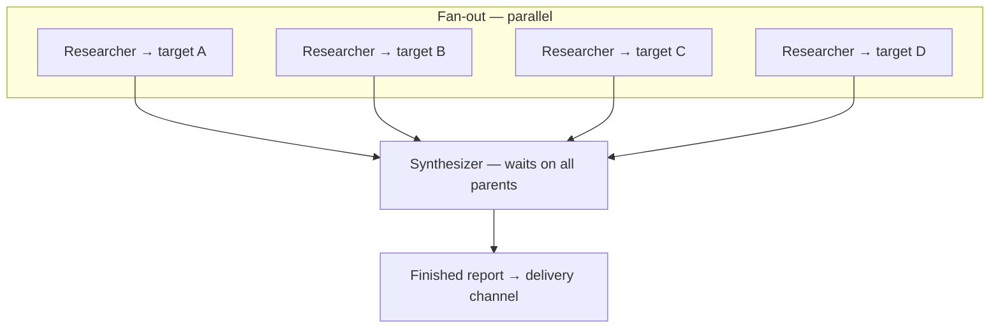

# Hermes parallel agents — research capture (July 2026)

Captured from the [Hermes Parallel Agents walkthrough video](https://www.youtube.com/watch?v=1MaFErWfL24)
and companion [Notion guide](https://app.notion.com/p/Hermes-Parallel-Agents-Full-Walkthrough-3812b085b46c805e8a3de54c20169359).

**Relevance to AI Digest:** our current `llm_pipeline` is a *staged, sequential*
LLM-enhanced batch job (`ingest → enrich → validate → render`). Hermes
demonstrates a *truly agentic* pattern: role-based agents, parallel fan-out,
dependency-driven fan-in, conversational orchestration, and scheduled automation.
This doc records the ideas for the experimental `agentic/hermes/` track.

---

## Executive summary

Hermes runs a **team of agents in parallel** on decomposed work, then a
**synthesizer agent** waits until all upstream tasks finish, reads their
artifacts, and produces a single polished deliverable (PDF → Telegram). The
system scales by adding **tasks**, not **agent profiles**. Automation stores
competitor lists and builder prompts in **memory**, pings the user on a
**cron schedule**, and rebuilds the entire kanban pipeline from a one-word
**GO** reply.

The central insight for AI Digest: **an agent is a role, not a subject.** One
researcher handles N categories/companies; one synthesizer composes the digest
after N parallel enrichers complete.

---

## Why parallel beats sequential

| Sequential (current ceiling) | Parallel (Hermes) |
|---|---|
| One LLM pass after another | N workers at the same time |
| Total time ≈ sum of tasks | Total time ≈ max(task durations) + synthesizer |
| Adding a source lengthens every run linearly | Adding a source adds one task card |
| Orchestration is hard-coded in Python stages | Orchestration is task graph + dependencies |

Speed comes from **concurrency**, not faster typing. Four researchers finishing
in parallel beats one model doing four jobs back-to-back.

---

## Core architecture pattern



### Kanban task model

1. **Research tasks** — title = target (company, category, feed). Same
   **assignee** (`researcher` profile). Description = goal prompt for that
   target. No assignee → task sits idle until armed.
2. **Synthesizer task** — assignee = smart model (`default` / pro tier).
   **Parents** = all research tasks. Blocked until every parent is Done.
3. **Board poll** — gateway checks ready tasks ~every 60s; **Nudge** forces
   immediate dispatch.

This is **fan-out / fan-in**: parallel workers post summaries as task comments;
synthesizer reads comments and builds the deliverable.

---

## Role vs subject (the scaling mistake)

**Wrong:** four agent profiles named Asana, ClickUp, Monday, Notion — one agent
per company.

**Right:** one `researcher` profile:

- Description: *"Researches a company's pricing and features."*
- Model: fast/cheap tier (`deepseek-v4-flash`) — fetch and summarize only.
- Same profile assigned to every research task; only the **task description**
  changes per target.

Analogy: hire one researcher and hand them four assignments — don't hire four
people because you have four reports.

**AI Digest mapping:**

| Hermes demo | AI Digest equivalent |
|---|---|
| Company pricing page | Category / feed / leaderboard source |
| `researcher` profile | Category researcher or source enricher role |
| Task comment with summary | Structured story stub + provenance token |
| `Synthesizer` | Digest composer: summary, charts, HTML render |
| Competitor list in memory | `config.yaml` source registry + editorial scope |
| Telegram GO | Admin trigger or scheduled ping + confirm |

---

## Model tiering

- **Researchers:** flash/fast model — scrape, summarize, post comment.
- **Synthesizer:** pro/smart model — reasoning, positioning takeaway, layout,
  chart design, PDF generation.

Match model cost to cognitive load. Don't run pro on "read this pricing page."

**AI Digest mapping:** gap-fill and curation could stay on local Ollama; final
daily summary + visualization narrative might use a stronger model or a dedicated
synthesizer pass (already partially exists as pass 4 in `enrich.py`).

---

## Prompt design — goal, not how

The synthesizer prompt specifies:

- **Output shape:** PDF via HTML/CSS → WeasyPrint (fallback: headless Chrome).
- **Brand/style guide:** colors, fonts, edge-to-edge dark layout, SVG charts.
- **Content sections:** cover, executive takeaway, charts, comparison table,
  top-5 features, positioning matrix.
- **Delivery:** save path + `MEDIA:` Telegram directive.

It deliberately does **not** specify install commands, library versions, or
button clicks. The agent figures out setup (e.g. first-run `pip install
weasyprint` in a venv).

> Give the *what*; let the agent own the *how*. Reliable agents vs brittle scripts.

**AI Digest mapping:** editorial brief + enrich prompts already state goals;
Hermes pushes further — the **render stage** could become agent-owned (HTML/PDF
generation) rather than a fixed Jinja/template pipeline, for A/B comparison.

---

## Tooling: kanban as orchestration API

Default Hermes agent runs the board but cannot **create tasks** until `kanban`
is added to the toolset in `config.yaml`:

```bash
docker exec -it hermes cp /opt/data/config.yaml /opt/data/config.yaml.bak
docker exec -it hermes sed -i '/^- hermes-cli$/a - kanban' /opt/data/config.yaml
docker exec -it hermes hermes -p default gateway restart
```

Without kanban, automation cannot fan out from chat. **Task creation is the
orchestration primitive.**

**AI Digest mapping:** Hermes needs an equivalent task graph store — could be
kanban, a lightweight SQLite job queue, or Redis streams — that agents read/write
via tools.

---

## Automation layer

### Memory (two blobs)

1. **Competitor list** — mutable standing list, updated by chat ("add Linear").
2. **Report-builder prompt** — synthesizer instructions, labeled in memory.

### Cron constraint

Scheduled jobs **cannot ask and wait**. Pattern:

- **Ping job (9am):** read list from memory → send Telegram message → stop.
- **User replies GO (normal chat):** create N research tasks + 1 synthesizer with
  parents → confirm counts.

Separate **list mutation** from **execution**:

```
"Add Linear to my competitor list. Just update memory — do not create or run anything yet."
```

vs.

```
GO
```

**AI Digest mapping:** daily digest cron could ping "Run digest for 2026-07-05?
Sources: [list]. Reply GO or edit." — matching our disciplined workflow without
blocking the scheduler.

---

## Dynamic scaling demo

Starting list: ClickUp, Monday, Asana, Notion (4 research + 1 synthesizer).

Add Linear via chat → memory only → board unchanged.

Reply `GO` → 5 research tasks + synthesizer waiting on all 5.

> One word reshapes the machine. That's an agent, not a script.

---

## Deliverable quality bar

The demo PDF is not a text dump:

- Cover with title, date, all platforms.
- **Executive takeaway with a verdict** ("ClickUp wins on price-to-feature
  ratio") — opinion, not just data.
- Branded SVG bar charts.
- Full tier/pricing breakdown.
- Top-5 cross-platform features, ranked.
- Positioning matrix: price range, strength, ideal customer.

The synthesizer **takes a position**. This aligns with AI Digest editorial brief
goals (significance, novelty, design relevance) but Hermes applies it at
**report level**, not just per-story scoring.

---

## Operational notes from the walkthrough

### Telegram gateway conflicts

Restart failures often = two gateways holding the same bot token. Fix: paste
error into Hermes chat, ask it to close stray gateways. Root cause: a profile
gateway blocking the default gateway.

### First synthesizer run

Installs rendering deps on first use (~1 min). Agent self-provisions; operator
waits for Telegram delivery.

### Hostinger VPS

Demo assumes Hermes 24/7 on Docker/Ubuntu VPS. AI Digest is local-first Ollama;
agentic orchestration could still run locally or on a small VPS for scheduled
fan-out while enrich workers hit local GPU.

---

## Mapping: Hermes demo → AI Digest agentic design

| Hermes component | Proposed Hermes module | Reuse from `llm_pipeline` |
|---|---|---|
| `researcher` profile | `agentic/hermes/profiles/researcher.yaml` | `fetch`, parsers, `tools.verify_url` |
| Research task | One per category or source cluster | `editorial.py` context builders |
| Task comment artifact | Structured JSON story batch | `schema.StoryEnrich` |
| `Synthesizer` profile | `profiles/synthesizer.yaml` | `render.py`, `visualize.py` |
| Kanban board | Task store adapter | — (new) |
| Memory: source list | Config + chat overrides | `config.yaml` ingestion |
| Memory: builder prompt | Synthesizer system prompt | `editorial_brief.md` |
| Cron ping | `agentic/hermes/schedule.py` | — (new) |
| GO handler | Orchestrator agent w/ kanban tool | `tools/baseline.py` for A/B |
| PDF/Telegram delivery | Optional; we deliver HTML archive | `render`, `reports/` |
| Grounding / provenance | **Must keep** — Hermes demo lacks this | `grounding.py` guard |

---

## Gaps in the Hermes demo (AI Digest must preserve)

1. **Provenance** — demo posts free-text comments; we need deterministic
   `provenance` tokens and clickable traces.
2. **Grounding guard** — demo trusts scraped summaries; we demote ungrounded URLs.
3. **Validation gates** — `min_total_stories`, required categories, significance
   floors — not in demo.
4. **Fixture-backed tests** — agent flows need recorded task graphs for CI.
5. **Re-render decoupling** — UI-only changes must not re-run agents.

The agentic track should **add** parallelism and conversational ops, not
**subtract** auditability.

---

## A/B testing strategy

Run both pipelines on the same preflight skeleton / run prefix:

1. **Baseline:** `python run.py --start <date>` → `llm_pipeline` full staged run.
2. **Hermes:** fan-out researchers per category → synthesizer → JSON/HTML in
   `reports/<prefix>-hermes.json`.
3. **Compare:** story count, category coverage, grounding violations, editorial
   quality (human or rubric), wall-clock time, token cost.

Adapter entry point: `agentic/hermes/tools/baseline.py`.

---

## Suggested implementation phases

### Phase 0 — scaffold (this branch)

- [x] `llm_pipeline/` — production code moved, `pipeline/` shims preserved
- [x] `agentic/hermes/` — docs + baseline adapters
- [x] Research capture (this file)

### Phase 1 — task graph MVP

- Local task store (kanban-compatible API or minimal JSON board)
- Two profiles: `researcher`, `synthesizer`
- Manual fan-out: 3 categories → synthesizer → compare to baseline JSON

### Phase 2 — grounding + provenance in agent artifacts

- Research tasks emit `StoryEnrich`-shaped JSON in comments
- Synthesizer runs grounding guard before render
- Provenance stamped by orchestrator, not model

### Phase 3 — conversational ops

- Memory-backed source list
- Ping + GO pattern (CLI or Telegram)
- Dynamic add/remove sources without code changes

### Phase 4 — production hardening

- Fixture-backed agent tests
- Diagnostics waterfall for per-agent timings
- Optional merge to main if A/B quality matches baseline

---

## Key quotes / principles (verbatim themes)

- *"One AI agent, one task at a time — that's the ceiling and it's slow."*
- *"An agent is a role, not a topic."*
- *"You're not telling it which buttons to press — you're giving it the goal and the output."*
- *"Adding a name and running the research are two different things."*
- *"A schedule job can't ask me and then sit there waiting for an answer."*
- *"They're faster because they work at the same time."*
- *"That's an agent, not a script — I didn't rewire anything, I told it."*

---

## References

- Video: https://www.youtube.com/watch?v=1MaFErWfL24
- Notion walkthrough: https://app.notion.com/p/Hermes-Parallel-Agents-Full-Walkthrough-3812b085b46c805e8a3de54c20169359
- Current staged pipeline: `llm_pipeline/` + `.agents/onboarding/architecture.md`
- Target agentic design: `../ARCHITECTURE.md`
