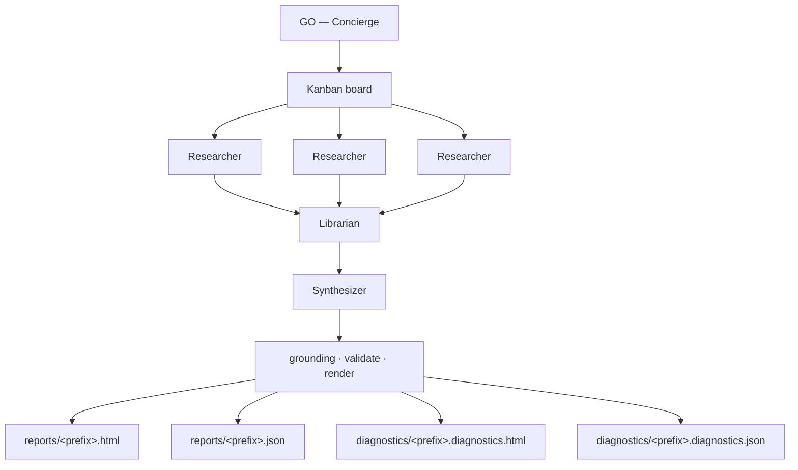
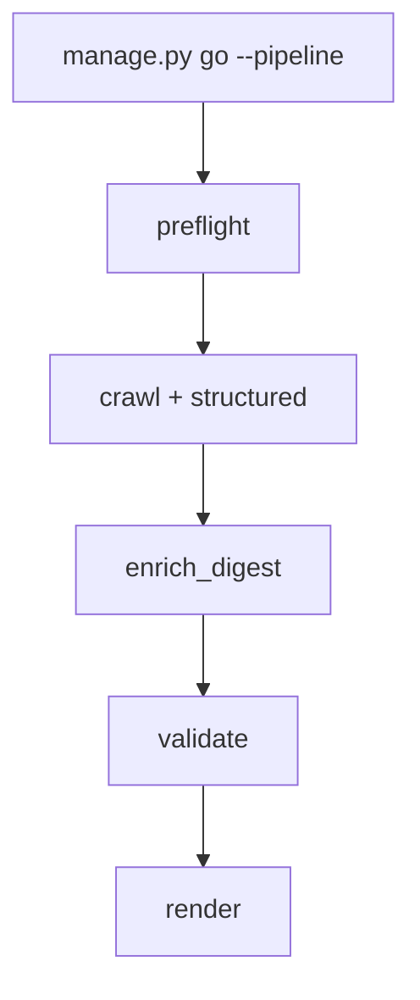
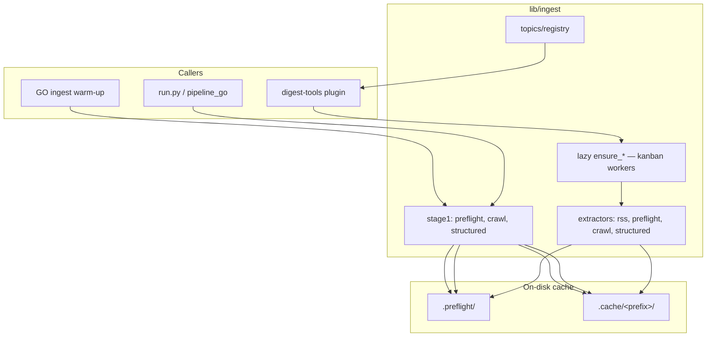

# Hermes target architecture

> **Canonical narrative:** [`README.md`](../../../README.md) at the repo root. **If this
> doc conflicts with README, README wins.**

> **Demo overview:** Hermes tree index at [`../README.md`](../README.md).

This document describes the **agentic digest** under `agentic/hermes/` — the
**one production system**: four ORIO roles on a kanban graph, shared ingestion
from `lib/ingest`, deterministic invariants from `llm_pipeline` (grounding,
validate, render). The staged batch CLI (`run.py` / `pipeline_go`) is a
**deprecated escape hatch**, not a second product.

**Related:** [`../system_roles.md`](../system_roles.md) · [`../working_agreements.md`](../working_agreements.md) · [`../POC.md`](../POC.md)

---

## Mental model

| Layer | What it is |
|---|---|
| **Orchestration** | Hermes kanban — Concierge → Researcher × N → Librarian → Synthesizer |
| **Shared libs** | `lib/ingest/` (fetch/parse), `llm_pipeline/` (schema, grounding, validate, render) |
| **Deprecated batch** | `run.py`, `pipeline_go.py` — same enrich path, no agent roles; use `--pipeline` only when debugging batch parity |

When agentic fully wins, **`run.py` batch orchestration stops**; `llm_pipeline/` remains
as libraries agents call through `tools/baseline.py`. The `pipeline/` tree at repo root is an
**import shim**, not a second product.

---

## Production end-to-end flow (default GO)

> **Canonical diagram:** [`README.md`](../../../README.md#orio-workflow-source-of-truth).
> **Do not change the graph or four-output contract without maintainer approval** —
> keep README and this section in sync.



**What happens on GO (default):**

1. **Concierge** parses date/history (or CLI runs `manage.py go`) and assembles /
   reuses the kanban board. **Board topics:** by default, one research task per
   non-empty category from the **best known-good report** (most stories, passes
   validation) — see `tools/topics.py`. Override via `demo_topics` in yaml.
2. **Ingest warm-up** runs deterministic preflight + crawl + structured fetch into
   `.preflight/` and `.cache/<prefix>/` so researchers hit warm cache.
3. **Researchers** (parallel Hermes workers, `orio_researcher`) each take one target;
   reflect, `verify_url`, and ground **their own** `output.md`. Librarian and
   Synthesizer trust that per-target work — they merge/compose, not re-research.
4. **Librarian** (`orio_librarian`) fan-in: resolve overlap, map articles and data
   points to standing topics, dedupe/regroup → `librarian.md` + knowledge graph.
5. **Synthesizer** (`orio_synthesizer`) reads **`librarian.md` only** — format,
   schema, and prose via `synthesize_digest` → `digest.json` (no curatorial rework).
6. **Grounding + validate + render** — same deterministic modules as the old batch
   pipeline; not LLM-judged.
7. **`finish_collector`** writes diagnostics (stage timings, token counts, LLM table).

Render requires a valid `digest.json` — no showcase render fallback.

**Flags:** `--fresh` archives and recreates the board. `--skip-dispatch` renders from
existing artifacts. `--rounds` caps research dispatch retries.

**Eval-only exception:** `evaluation_test_topic` may use committed fixtures under
`tests/data/evaluation/`.

---

## Batch escape hatch (`go --pipeline`)

For batch parity with `run.py` (re-enrich from cache, A/B against old CLI) —
**not** default GO:



Implemented in `tools/pipeline_go.py`. Skips kanban workers entirely.
Use when Hermes gateway is unavailable or you need identical behavior to `run.py`.

**Flags:** `--skip-ingest` reuses cached preflight/crawl. `--fetch-only` stops after ingest.

---

## Shared ingestion (`lib/ingest`)

Source-kind logic lives **once** in `lib/ingest/` — generic extractors + topic registry.



| Source kind | Extractor | GO warm-up | Researcher tool |
|---|---|---|---|
| Preflight skeleton | `extractors/preflight` | `run_preflight` | `read_preflight_category` |
| RSS / Atom | `extractors/rss` | preflight | `fetch_rss` |
| Crawl markdown | `extractors/crawl` | `crawl_leaderboards` | `read_crawl_markdown` |
| Structured JSON | `extractors/structured` | `fetch_structured_sources` | `read_structured_json` |
| URL check | `lib/ingest/web` | — | `verify_url` |
| Web discovery | Hermes ddgs | — | `web_search` |

**Ingestion rules (approved):** implement fetch/parse once under `lib/ingest/`.
Extractors are **mechanism-shaped** (RSS, preflight, crawl, structured JSON) — not
topic-shaped. Hermes tasks stay topic-shaped (`Research: robotics`); the LLM closes
the editorial gap. Add a digest topic by extending `lib/ingest/topics/registry.py`
and (optionally) pinning `demo_topics` — no new plugin unless handoff contracts change.

---

## Role profiles (ORIO crew)

| Profile | Display name | Default GO | `--pipeline` |
|---|---|---|---|
| `orio_concierge` | Concierge | Assemble board; GO; assess; publish | Triggers batch only |
| `orio_researcher` | Researcher | One target → `output.md` (reflect + ground) | — |
| `orio_librarian` | Librarian | Resolve overlap; map to topics → `librarian.md` | — |
| `orio_synthesizer` | Synthesizer | Format, schema, prose → `digest.json` | — |

**Not roles:** grounding, validation, provenance — deterministic in `llm_pipeline`.

Model routing: `admin/config/hermes_roles.yaml` → remote Ollama.

| Tier | Model | When |
|---|---|---|
| Laptop (default) | `llama3.1:latest` (~5 GB, **128K** ctx) | Dev, POC, Hermes on MacBook |
| Showcase | `qwen3.6:35b` (~24 GB) | RTX 4090-class published runs |

Hermes requires **≥64K native context** — e.g. `qwen2.5:7b` (32K) is rejected even
if the Ollama slider is higher. Per-role overrides live in `hermes_roles.yaml`.

Canonical role definitions: [`../system_roles.md`](../system_roles.md).

---

## Runtime layout

**Production GO** writes four files per run under `agentic/hermes/reports/` and
`agentic/hermes/diagnostics/` (see root README). Intermediate kanban artifacts:


---

## Adapter surface

`agentic/hermes/tools/baseline.py` and `pipeline_go.py` wrap shared `llm_pipeline` libs:

| Function | Module | Default GO | `--pipeline` |
|---|---|---|---|
| Kanban orchestration | `admin/manage.py` `cmd_go_agents` | ✓ | — |
| `run_production_pipeline()` | `tools/pipeline_go.py` | — | ✓ |
| `validate_and_render()` | validate + render | ✓ | ✓ |
| `synthesize_digest()` | `tools/synthesize.py` | ✓ | — |
| `enrich_digest()` | `enrich.enrich_digest` | — | ✓ |
| `run_preflight()` etc. | `lib.ingest.stage1` | warm-up + batch | ✓ |

---

## File map

```
agentic/hermes/
├── admin/manage.py          # go (kanban default), go --pipeline, setup, assess
├── admin/config/
│   ├── hermes_roles.yaml    # Ollama routing, demo_topics
│   └── souls/               # worker SOUL templates
├── plugins/digest-tools/    # Concierge + worker tools
├── tools/
│   ├── pipeline_go.py       # batch escape hatch (--pipeline)
│   ├── digest_scaffold.py   # empty 12-category shell
│   ├── baseline.py          # llm_pipeline adapters
│   ├── synthesize.py        # Instructor synthesis (Synthesizer)
│   ├── artifacts.py         # kanban artifact gates
│   └── runtime_store.py     # .runtime/artifacts
├── reports/                 # production HTML + JSON
└── diagnostics/             # per-run waterfall JSON/HTML
```

---

## E2E test readiness

See [`../POC.md`](../POC.md) for bootstrap phases. Quick checks:

| Check | Command / location |
|---|---|
| Unit tests | `python -m unittest tests.test_board_topics tests.test_pipeline_go -v` |
| Full suite | `python run_tests.py` |
| GO dry run (batch) | `python agentic/hermes/admin/manage.py go --pipeline --dry-run` |
| Full agentic run | `python agentic/hermes/admin/manage.py go --start YYYY-MM-DD --fresh` |
| Kanban smoke | `python agentic/hermes/admin/manage.py verify-handover` |
| Eval fixtures | `demo_topics: [evaluation_test_topic]` in `hermes_roles.yaml` |
| Diagnostics rebuild | `python agentic/hermes/admin/manage.py diagnostics --prefix <prefix>` |

---

## Non-negotiables

1. **Honest, auditable data** — provenance tokens; no fabricated links.
2. **Grounding guard** — deterministic post-Synthesizer.
3. **Validation gates** — category counts, required IDs.
4. **Fixture-backed tests** — real data under `tests/data/`.
5. **Re-render decoupling** — UI changes do not re-run LLM.
6. **Documentation matches code** — production GO is the four-role kanban graph.

---

## Approved state (decisions)

| Topic | Decision |
|---|---|
| Production GO | Kanban crew — Concierge → research × N → librarian → synthesizer |
| Default `manage.py go` | Agentic kanban (not batch enrich) |
| Batch escape hatch | `go --pipeline` / `run.py` — debug/A/B only |
| Batch orchestration | Deprecated; `llm_pipeline/` = shared libs |
| Repo layout | Product under `agentic/hermes/`; root `pipeline/` = import shim |
| Ingestion | Single implementation in `lib/ingest/`; generic worker tools |
| Extractors vs topics | Mechanism extractors + topic registry; LLM closes editorial gap |
| Board topics | Best known-good report by default; override `demo_topics` |
| Models (laptop) | `llama3.1:latest` via Ollama; showcase `qwen3.6:35b` when VRAM allows |
| Grounding / validate | Deterministic in `llm_pipeline` — not agent roles |
| Eval E2E topic | `evaluation_test_topic` + fixtures under `tests/data/evaluation/` |
