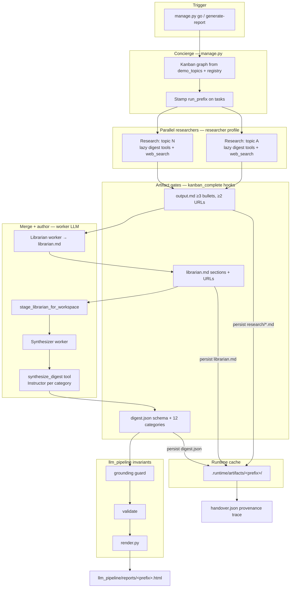
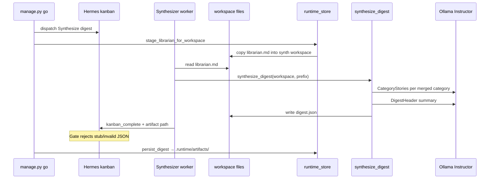
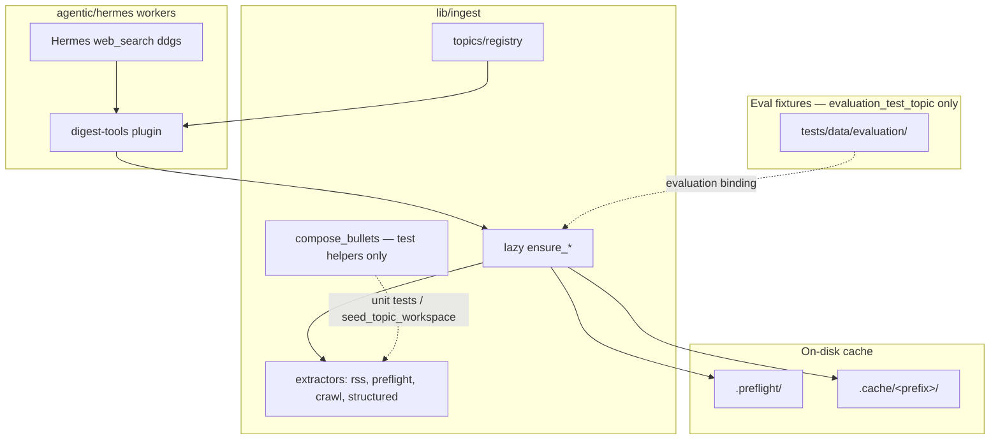
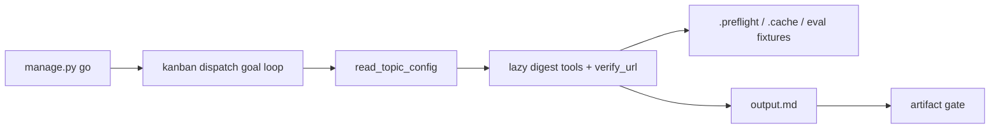
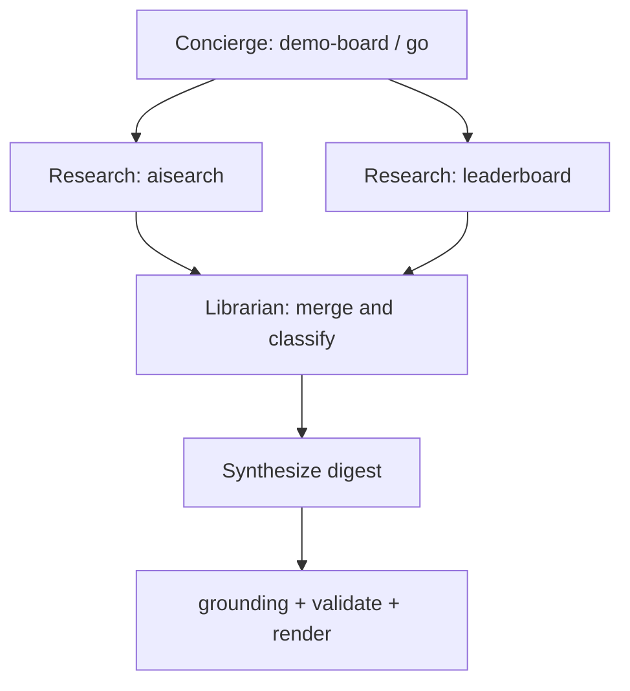
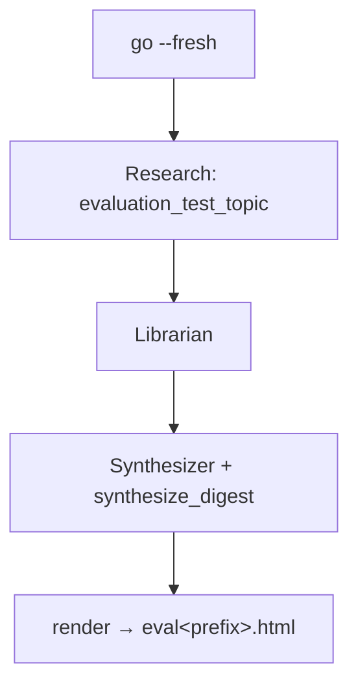
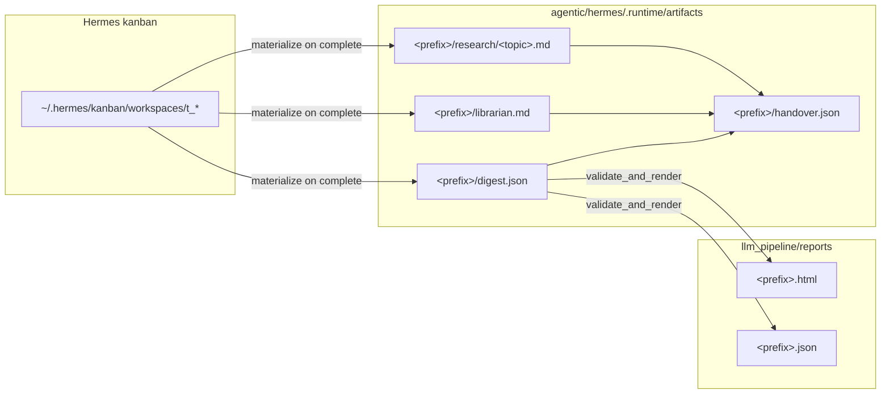

# Hermes target architecture (vs llm_pipeline)

> **Demo overview:** [README.md](../../README.md) at the repo root.

This document describes the **agentic digest** under `agentic/hermes/` — how it
reuses the staged pipeline, where implementation lives today, and how the task
graph scales.

**Related:** [`../system_roles.md`](../system_roles.md) · [`../working_agreements.md`](../working_agreements.md) · [`../HANDOFF.md`](../HANDOFF.md)

---

## Side-by-side

| | `llm_pipeline` (batch) | `agentic/hermes` (workers) |
|---|---|---|
| **Orchestrator** | `run.py` — fixed 4 stages | `manage.py` concierge + Hermes kanban |
| **Research** | Sequential preflight + enrich | Parallel **researcher** tasks (one profile, N targets) |
| **Merge** | In-process Python | **Librarian** worker → `librarian.md` |
| **Authoring** | Instructor structured calls | **Synthesizer** worker → `synthesize_digest` → `digest.json` |
| **Invariants** | Grounding, validate, provenance | Same modules — **not** agent roles |
| **Output** | `llm_pipeline/reports/` | Same render path via `validate_and_render` |
| **Trigger** | CLI / cron `run.py` | `manage.py go` (chat/Slack later) |

---

## End-to-end flow (implemented)



**Worker path:** `go` dispatches Hermes goal-mode workers. Researchers plan with
`read_topic_config`, then call lazy digest tools (`read_preflight_category`,
`read_crawl_markdown`, `read_structured_json`, `fetch_rss`, `verify_url`) and
Hermes `web_search`. Each tool ensures its cache slice on miss under
`.preflight/` and `.cache/<prefix>/`. Librarian and synthesizer are **real LLM
workers** — no deterministic seed shortcuts in production. Render **requires**
a valid `digest.json` from `synthesize_digest`; there is no showcase render
fallback.

**Eval-only exception:** `evaluation_test_topic` may use committed fixtures under
`tests/data/evaluation/` (the only approved deterministic shortcut).

---

## Synthesizer path (detail)



Carry-forward: categories not present in the librarian merge are filled from the
pinned baseline digest (`tools/showcase.load_baseline_digest`) inside
`synthesize.py` — this is **synthesizer editorial policy**, not a render bypass.

---

## Shared ingestion (`lib/ingest`)

Source-kind logic lives **once** in `lib/ingest/` — generic extractors + topic registry.



| Source kind | Extractor | Worker tool |
|---|---|---|
| Topic binding | `topics/registry` | `read_topic_config` |
| Preflight skeleton | `extractors/preflight` | `read_preflight_category` |
| RSS / Atom | `extractors/rss` | `fetch_rss` |
| Crawl markdown | `extractors/crawl` | `read_crawl_markdown` |
| Structured JSON | `extractors/structured` | `read_structured_json` |
| URL check | `lib/ingest/web` | `verify_url` |
| Web discovery | Hermes ddgs | `web_search` |
| Synthesis | `tools/synthesize.py` | `synthesize_digest` |

`warm_bundle()` remains for `llm_pipeline/run.py` batch stage1; **agentic GO does
not** call it. Researchers lazy-fetch per tool via `lib/ingest/lazy.py`.

See [ADR-003](adr/003-shared-ingestion-in-lib.md), [ADR-004](adr/004-extractors-vs-topics.md).

---

## Researcher dispatch



| Topic | Binding kinds | Worker approach |
|---|---|---|
| `aisearch` | preflight category | `read_preflight_category` + verify + prose |
| `leaderboard` | crawl + structured JSON | `read_crawl_markdown` + `read_structured_json` + verify + prose |
| `evaluation_test_topic` | all kinds (fixtures) | lazy tools seed from `tests/data/evaluation/` — **eval only** |

Scale by adding `demo_topics` + `TopicBinding` — **never** fork Hermes profiles per subject.

---

## Task graph

### Production (`demo_topics: aisearch, leaderboard, youtube`)



### Eval E2E (`demo_topics: evaluation_test_topic`)



```yaml
# Materialized by: python agentic/hermes/admin/manage.py demo-board
# demo_topics drives N research cards — one per topic in hermes_roles.yaml
tasks:
  - title: "Research: <topic>"
    assignee: researcher
    parents: []
  - title: "Librarian: merge & classify"
    assignee: librarian
    parents: [all research tasks]
  - title: "Synthesize digest"
    assignee: synthesizer
    parents: [librarian]
```

Artifacts: `output.md` → `librarian.md` → `digest.json` (see
`working_agreements.md` for target schemas; today enforced by markdown/JSON gates).

---

## Runtime layout



---

## Role profiles (ORIO crew)

| Profile | Display name | Tier | Responsibility |
|---|---|---|---|
| `orio_concierge` | Concierge | Smart | Topics, schedule, GO, task-graph assembly |
| `orio_researcher` | Researcher | Fast | One target → `output.md` |
| `orio_librarian` | Librarian | Smart | Merge, classify, graph sketch → `librarian.md` |
| `orio_synthesizer` | Synthesizer | Smart | Orchestrate `synthesize_digest` → `digest.json` |

**Not roles:** grounding, validation, provenance — deterministic in `llm_pipeline`.

Model routing: `admin/config/hermes_roles.yaml` → remote Ollama (`qwen3.6:35b` on
4090 host). See [ADR-001](adr/001-local-ollama-with-per-role-model-routing.md).

---

## Baseline adapter surface

`agentic/hermes/tools/baseline.py` wraps `llm_pipeline`:

| Function | Module | Used in agentic path |
|---|---|---|
| `default_config()` | `config.load_config` | ✓ render, researchers |
| `agentic_llm_config()` | `hermes_roles.yaml` routing | ✓ `synthesize_digest` |
| `validate_and_render()` | validate + render | ✓ `go` render phase |
| `run_preflight()` etc. | `lib.ingest.stage1` | ✓ `run.py` only |
| `run_staged_enrich()` | `enrich.enrich_digest` | A/B harness (future) |

---

## File map

```
agentic/hermes/
├── admin/manage.py          # go, generate-report, verify-handover, demo-board
├── admin/config/
│   ├── hermes_roles.yaml    # demo_topics, Ollama routing, toolsets
│   └── souls/               # worker SOUL templates (deployed on setup)
├── plugins/digest-tools/    # verify_url, fetch_rss, read_*, synthesize_digest
├── tools/
│   ├── baseline.py          # llm_pipeline adapters + agentic_llm_config
│   ├── artifacts.py         # artifact gates
│   ├── synthesize.py        # Instructor synthesis from librarian.md
│   ├── showcase.py          # baseline carry-forward (synthesizer only)
│   ├── handover_trace.py    # provenance receipt
│   ├── runtime_store.py     # .runtime/artifacts cache + staging
│   └── topics.py            # demo_topics + research_task_body
└── .runtime/artifacts/      # per-run research, librarian, digest, handover
```

---

## E2E test readiness

See [`../HANDOFF.md`](../HANDOFF.md) § E2E test runbook for commands and pass criteria.

| Check | Command / location |
|---|---|
| Offline fixture gate | `python -m unittest lib.tests.test_lazy_ingest -v` |
| Unit + LLM synthesizer | `python -m unittest tests.test_synthesizer -v` |
| Hermes CLI | `which hermes` |
| Ollama reachable | `curl http://192.168.1.20:11434/api/tags` |
| Model loaded | `qwen3.6:35b` in tags |
| Board config | `demo_topics: [evaluation_test_topic]` in `hermes_roles.yaml` |
| Full worker E2E | `python agentic/hermes/admin/manage.py go --fresh --prefix eval$(date -u +%Y%m%d%H%M%S)` |

**Policy:** no `materialize_only`, no showcase assembly in `go`, no ddgs research
fallback for unknown topics. Workers must pass artifact gates or the run fails.

---

## Non-negotiables

1. **Honest, auditable data** — provenance tokens; no fabricated links.
2. **Grounding guard** — deterministic post-synthesis.
3. **Validation gates** — category counts, required IDs.
4. **Fixture-backed tests** — real data under `tests/data/`.
5. **Re-render decoupling** — UI changes do not re-run agents.
6. **No production bypasses** — only `evaluation_test_topic` uses committed fixtures.

---

## Decisions log

| Question | Decision | Date |
|---|---|---|
| First real researchers | `aisearch` + `leaderboard` | 2026-07-06 |
| Eval E2E topic | `evaluation_test_topic` + `tests/data/evaluation/` | 2026-07-06 |
| Synthesizer implementation | Worker calls `synthesize_digest` (Instructor) | 2026-07-06 |
| Render fallback | None — valid `digest.json` required | 2026-07-06 |
| Task store | Hermes kanban + `.runtime/artifacts/` | POC |
| Models | Remote Ollama `qwen3.6:35b` @ 192.168.1.20:11434 | 2026-07-06 |
