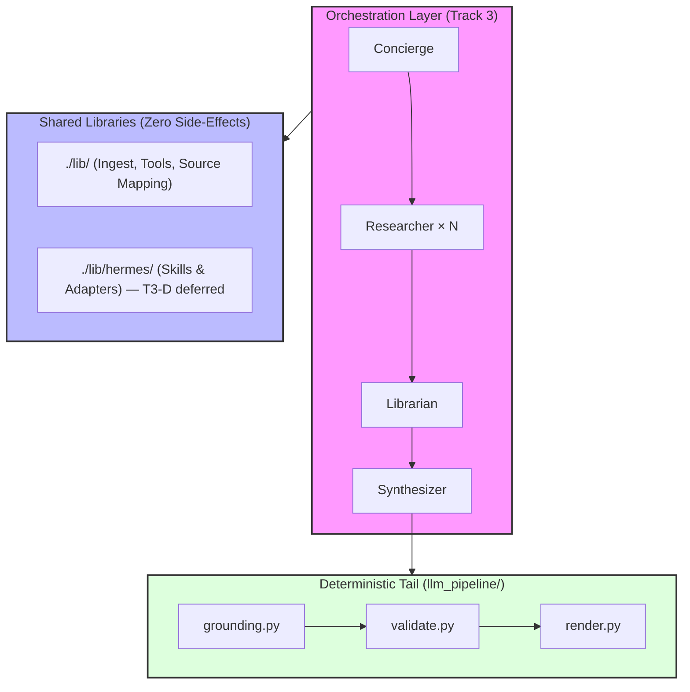
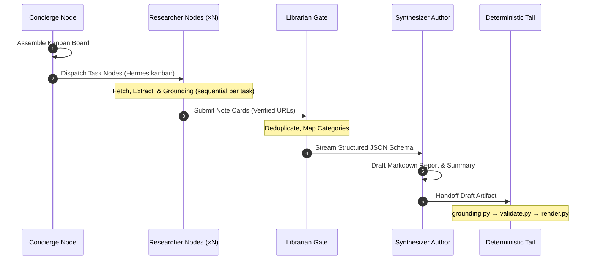
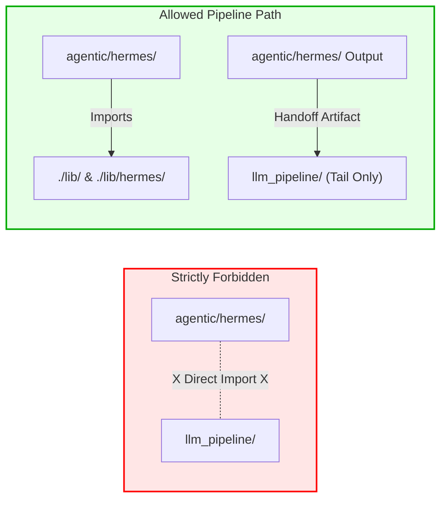

# Hermes Target Architecture (`agentic/hermes/`)

> **Governing Policy (ADR-002):** `agentic/hermes/` represents the **Track 3 Multi-Agent Kanban experimental runtime**. Per **ADR-002**, Track 3 is maintained as an active **bounded parallel benchmark experiment** to evaluate multi-agent performance against strict parity gates ($\ge 55$ stories, $11/11$ categories, $\le 5\%$ provenance gap vs batch baseline). It is **not** the default production driver.

> **Canonical Narrative:** [`README.md`](../README.md) in the `agentic/hermes/` root directory. **If this doc conflicts with README, README wins.**

---

## Mental Model & System Boundaries


```mermaid
flowchart TD
    subgraph Orchestration["Orchestration Layer (Track 3)"]
        A[Concierge] --> B[Researcher × N]
        B --> C[Librarian]
        C --> D[Synthesizer]
    end

    subgraph SharedLibs["Shared Libraries (Zero Side-Effects)"]
        E["./lib/ (Ingest, Tools, Source Mapping)"]
        F["./lib/hermes/ (Skills & Adapters) — T3-D deferred"]
    end

    subgraph Tail["Deterministic Tail (llm_pipeline/)"]
        G[grounding.py] --> H[validate.py] --> I[render.py]
    end

    Orchestration --> SharedLibs
    D --> Tail

    style Orchestration fill:#f9f,stroke:#333,stroke-width:2px
    style SharedLibs fill:#bbf,stroke:#333,stroke-width:2px
    style Tail fill:#dfd,stroke:#333,stroke-width:2px

```

| Layer | What It Is & Execution Model |
| --- | --- |
| **Orchestration (Track 3)** | **Hermes Kanban dispatch** (current implementation). An Async Waterfall DAG is a proposed future architecture (not yet implemented) — see `track_3_issue_0001.md` for the design goal. |
| **Shared Libraries** | `./lib/` (domain-agnostic tools, ingestion, source mapping), `./lib/hermes/` (T3-D deferred — not yet created). |
| **Deterministic Tail** | `llm_pipeline/` (`grounding.py` → `validate.py` → `render.py`). Shared by all tracks for post-synthesis verification and output rendering. |
| **Batch Escape Hatch** | `go --pipeline` (`run.py`) — deprecated legacy runner kept purely for debug/A/B parity testing. |

When Track 4 (Single-Agent with Skills) becomes full production default, `agentic/hermes/` will serve as the reference benchmark. All tracks call into `./lib/` and hand off to `llm_pipeline/` for post-synthesis validation and rendering.

---

## 4-Role Architecture

ORIO divides intelligence across four distinct roles. The current implementation uses Hermes kanban dispatch; an **Async Waterfall DAG** is a proposed future architecture (not yet implemented).

> **Note:** The Async Waterfall DAG — concurrent I/O on CPU with semaphore-based task triggering — is documented as a design goal in `track_3_issue_0001.md` but has not been implemented. Current execution uses sequential Hermes kanban dispatch.


```mermaid
sequenceDiagram
    autonumber
    participant Concierge as Concierge Node
    participant Researcher as Researcher Nodes (×N)
    participant Librarian as Librarian Gate
    participant Synthesizer as Synthesizer Author
    participant Tail as Deterministic Tail

    Concierge->>Concierge: Assemble Kanban Board
    Concierge->>Researcher: Dispatch Task Nodes (Hermes kanban)
    Note over Researcher: Fetch, Extract, & Grounding (sequential per task)
    Researcher->>Librarian: Submit Note Cards (Verified URLs)
    Note over Librarian: Deduplicate, Map Categories
    Librarian->>Synthesizer: Stream Structured JSON Schema
    Synthesizer->>Synthesizer: Draft Markdown Report & Summary
    Synthesizer->>Tail: Handoff Draft Artifact
    Note over Tail: grounding.py → validate.py → render.py

```

### 1. Concierge Node

* **Responsibility:** Single point of entry. Maintains standing topic lists, user schedules, and execution triggers.
* **Invariants:** Assembles the task graph and dependent worker nodes ($S$ sources, $C$ categories). Never fetches web sources directly or writes report summaries.

### 2. Researcher Nodes (× N Parallel Workers)

* **Responsibility:** Target-focused worker nodes bound to specific sources, feed clusters, or category channels.
* **Execution:** Network fetching, HTML extraction, and parsing via Hermes kanban dispatch. Model reasoning steps produce structured note cards with verified source URLs.
* **Quality Guard:** Reflects and grounds its own artifact before pushing downstream.

### 3. Librarian Gate

* **Responsibility:** Deduplication, schema enforcement, and synthesis gate.
* **Execution:** Evaluates incoming Researcher cards, maps facts to standard categories, produces clean JSON schemas.

### 4. Synthesizer Author

* **Responsibility:** Final digest drafting.
* **Execution:** Consumes structured JSON schemas from the Librarian to draft executive summaries and formatted Markdown reports without prompt drift.

---

## Model Target & Hardware Strategy

The target model for Track 3 is **`qwen3.6:35b`** via Ollama, chosen to address historical context rot and prompt drift observed with `llama3.1`. This is a design goal, not yet deployed.

* **Target Model:** **`qwen3.6:35b`** (design goal — not yet deployed)
* **Context Depth:** High-capacity context window to support multi-source Librarian fan-in without hallucination.
* **CPU/GPU Workstation Split:** CPU handles network fetching and parsing asynchronously; GPU inference executes sequentially per task node.

---

## Architectural Isolation & Boundary Rules

Per **ADR-002**, Track 3 enforces strict software engineering boundaries to prevent code bloat and circular dependencies:


```mermaid
graph LR
    subgraph Forbidden["Strictly Forbidden"]
        A["agentic/hermes/"] -.-|X Direct Import X| B["llm_pipeline/"]
    end

    subgraph Allowed["Allowed Pipeline Path"]
        C["agentic/hermes/"] -->|Imports| D["./lib/ & ./lib/hermes/"]
        E["agentic/hermes/ Output"] -->|Handoff Artifact| F["llm_pipeline/ (Tail Only)"]
    end

    style Forbidden fill:#ffe6e6,stroke:#ff0000,stroke-width:2px
    style Allowed fill:#e6ffe6,stroke:#00aa00,stroke-width:2px

```

1. **Zero Cross-Pipeline Imports:**
* `agentic/hermes/` **must never import from `llm_pipeline/**`.
* All shared business logic resides in `./lib/` (e.g., `bundle.py`, `agent_tools.py`, `report_source.py`).
* Skill loading and adapter integration live in `./lib/hermes/` (T3-D deferred — not yet created).


2. **Fail-Loud Policy (No Silent Fallbacks):**
* Pre-flight checks (`_hermes_gateway_health()`) verify gateway and board availability before launching.
* If the gateway drops or a task stalls, execution aborts immediately with a non-zero exit code.
* **No silent fallbacks** to `llm_pipeline/` batch execution are permitted during a Track 3 run.


3. **Deterministic Tail Handoff:**
* Agent execution ends after the Synthesizer generates the raw digest artifact.
* The final report is processed by the shared deterministic tail (`llm_pipeline/grounding.py` → `llm_pipeline/validate.py` → `llm_pipeline/render.py`) for schema verification and rendering.


---

## Technical Invariants & Parity Gates

To remain active, Track 3 must satisfy the following criteria measured by `t3_metrics.py`:

| Metric Gate | Threshold | Description |
| --- | --- | --- |
| **Story Yield** | $\ge 55$ stories | Total grounded stories produced per daily run. |
| **Category Coverage** | $11/11$ categories | Full coverage across all configured domain categories. |
| **Provenance Gap** | $\le 5\%$ gap | Ratio of unverified or broken source links vs batch baseline. |
| **Boundary Integrity** | 0 illegal imports | Zero direct imports from `llm_pipeline/` within `agentic/hermes/`. |

---

## Non-Negotiable Engineering Rules

1. **Honest, Auditable Data:** All stories must maintain strict provenance tokens; no fabricated URLs or hallucinated domains.
2. **Post-Synthesizer Grounding Guard:** The deterministic tail strictly validates claims against raw source text after synthesis.
3. **Strict Validation Gates:** Mandatory category counts and structural schema validation prior to output generation.
4. **Fixture-Backed Verification:** Unit and integration tests must run against real, recorded fixtures under `tests/data/`.
5. **Decoupled Rendering:** Modifying UI markdown styling or HTML templates must never require re-running LLM inference.
6. **Documentation Equivalence:** System documentation must precisely mirror codebase execution paths.

---

## CLI & Operability Workflows

```bash
# Pre-flight environment check and dependencies setup
python agentic/hermes/admin/manage.py bootstrap

# Execute Track 3 Kanban Benchmark (Fail-Loud mode)
python agentic/hermes/admin/manage.py go --start 2026-07-09 --history 10 --fresh

# Legacy batch runner (Debug & Parity comparison only)
python agentic/hermes/admin/manage.py go --pipeline --start 2026-07-09

# Rebuild diagnostics waterfall log
python agentic/hermes/admin/manage.py diagnostics --prefix <run_prefix>

# Run Track 3 Telemetry & Parity Gate Benchmark Tests
python -m unittest discover -s agentic/hermes/tests -p "test_*.py"

```

---

## Approved Architectural State

| Topic | Decision / Approved State |
| --- | --- |
| **Primary System Track** | Track 4 (Single-Agent with Skills) is the primary target production driver. |
| **Track 3 Status** | Bounded parallel benchmark subject to ADR-002 parity gates. |
| **Execution Pattern** | Hermes kanban dispatch (current); Async Waterfall DAG is a proposed future architecture. |
| **Model Target** | `qwen3.6:35b` (design goal — not yet deployed) via Ollama. |
| **Library Layout** | Core utilities in `./lib/`; Hermes adapters in `./lib/hermes/` (T3-D deferred). |
| **Failure Policy** | Fail hard on gateway error / protocol timeout; zero cross-pipeline fallbacks. |
| **Deterministic Tail** | Shared calls to `grounding.py` → `validate.py` → `render.py`. |

