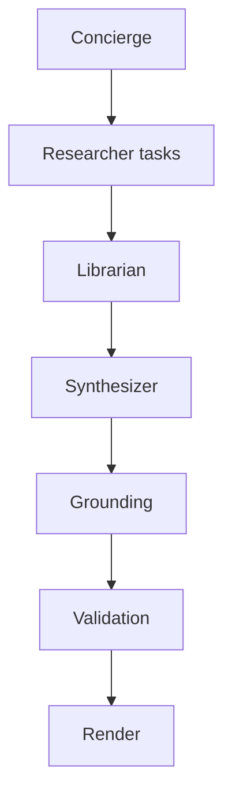

# Hermes Multi-Agent Architecture

This document describes the Hermes Multi-Agent POC for AI Digest. The
archive-facing overview lives in [`../README.md`](../README.md), and approved
published artifacts live in [`../../../app/`](../../../app/).

## Mental Model


```mermaid
flowchart TD
    A[Concierge] --> B[Researcher tasks]
    B --> C[Librarian]
    C --> D[Synthesizer]
    D --> E[Grounding]
    E --> F[Validation]
    F --> G[Render]
```

Hermes owns the role handoffs. Python owns deterministic validation, grounding,
and rendering.

## Roles

| Role | Responsibility | Does Not Do |
|---|---|---|
| Concierge | Starts a run, creates/observes the board, tracks status | Fetch sources or write final stories |
| Researcher | Fetches topic-specific material and produces grounded notes | Merge every topic or write the final digest |
| Librarian | Deduplicates, groups, and prepares the synthesis skeleton | Fetch new sources after the research phase |
| Synthesizer | Produces digest-ready structured content | Trust ungrounded links without the deterministic tail |

## Boundaries

1. Role prompts and Hermes adapters belong under `agentic/hermes/` or
   `lib/hermes/`.
2. Shared deterministic helpers belong under `lib/`.
3. Published website artifacts belong under `app/`.
4. Local caches, logs, and scratch state are not portfolio artifacts.

## Run

```powershell
python agentic/hermes/admin/manage.py bootstrap
python agentic/hermes/admin/manage.py go --start 2026-07-09 --history 10 --fresh
```

A full run requires Hermes gateway access and a local Ollama-compatible model.

## Outputs

| Output | Path |
|---|---|
| Development reports | `agentic/hermes/reports/` |
| Development diagnostics | `agentic/hermes/diagnostics/` |
| Approved website reports | `app/reports/` |
| Approved website diagnostics | `app/diagnostics/` |

## Archive Notes

Historical track handoff files were consolidated into
[`ARCHIVE_NOTES.md`](ARCHIVE_NOTES.md). Keep this architecture doc focused on the
finished POC shape, not temporary agent coordination.