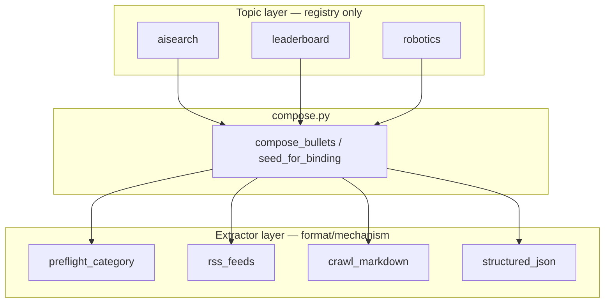

# ADR-004: Extractors vs topics — LLM closes the gap

**Status:** Accepted  
**Date:** 2026-07-06  
**Scope:** Naming and layout for ingestion — RSS, crawl, API, preflight  

**Related:** [003](003-shared-ingestion-in-lib.md)

---

## Context

Ingestion sources mix **mechanisms** and **editorial topics**:

| What we fetch | Mechanism | Wrong name |
|---------------|-----------|------------|
| Robot Report + IEEE + Robohub | RSS/Atom feeds | `robotics.py` |
| theAIsearch chapters (stage1) | Preflight category reader | `aisearch.py` composer |
| AA leaderboard pages | Crawl4AI markdown | `leaderboard.py` |
| SWE-bench / EvalPlus | Structured JSON API | (same) |

Hermes tasks stay **topic-shaped** (`Research: robotics`) because Concierge and
Librarian think in standing categories. Fetch/parse code must **not** be
topic-shaped — otherwise we duplicate RSS logic under every category.

---

## Decision

### Principle: generic tools, LLM closes the gap

Extractors return **raw or skeleton bullets** (title + URL, maybe a score).
Researchers, librarians, and synthesizers use the **LLM** to:

- pick what matters for the beat  
- write summaries and connective prose  
- verify and reject bad URLs (`verify_url`)  
- merge overlapping sources  

Do **not** bake editorial voice, episode framing, or narrative into Python
topic modules. Stage1/preflight may enrich skeleton JSON (YouTube metadata);
Hermes reads it generically via `read_preflight_category`.

### Two layers + compose

1. **`lib/ingest/extractors/`** — reusable by *source kind*  
   - `rss.py`, `preflight.py`, `crawl.py`, `structured.py`  
   - No topic names in this tree.

2. **`lib/ingest/topics/registry.py`** — data-only `TopicBinding`  
   (topic id → which extractors to run + feed URLs).

3. **`lib/ingest/compose.py`** — `compose_bullets(cfg, bundle, binding)`  
   runs extractors; no topic-specific Python.

4. **`lib/ingest/dispatch.py`** — compose helpers for tests (`seed_topic_workspace`).

### Hermes tools (agent-facing)

| Tool | Role |
|------|------|
| `read_topic_config` | Registry row — kinds, feeds, slugs, rubric |
| `fetch_rss` | Generic syndication fetch (topic defaults when feeds omitted) |
| `read_preflight_category` | Read stage1 skeleton category (lazy ensure) |
| `read_crawl_markdown` | Read crawl markdown slug (lazy crawl/copy) |
| `read_structured_json` | Read structured JSON slug (lazy fetch/copy) |
| Hermes `web_search` (ddgs) | Discover URLs — verify before citing |
| `verify_url` | Required before citing |

Workers plan with these tools; `research_topic` is not registered on the digest toolset.

### Lazy fetch vs batch warm

- **Agentic GO:** no central `warm_bundle`. Each tool calls `ensure_*` in
  `lib/ingest/lazy.py` (idempotent under `.cache/<prefix>/`).
- **Pipeline `run.py`:** still uses `warm_bundle()` for full stage1 batch.
- **Eval topic:** `evaluation_test_topic` seeds from `tests/data/evaluation/` when
  `TopicBinding.evaluation` is true (no live network in unit tests).

### Preflight vs live extractor

Stage 1 runs vendor fetchers into **preflight JSON**. Most categories:
**read preflight**, do not re-fetch RSS on every handover.

Direct `rss_feeds` is for tests, fixtures, and eventual migration of
`fetch_robotics_news.py` to `lib.ingest.extractors.rss`.

### Naming rules

| Name | Use for | Do not use for |
|------|---------|----------------|
| `extractors/rss.py` | RSS/Atom parse + fetch | A specific beat |
| `topics/registry.py` | topic → kinds + feeds | HTTP logic |
| `aisearch.py` / `leaderboard.py` | Deprecated shims → compose | New topic logic |
| Hermes `fetch_*` / `read_*` | Worker tools | Per-topic wrappers |

---

## Consequences

- **Positive:** Adding robotics = one registry row, not a new module; LLM owns prose.
- **Positive:** Seed traces are explicit (`lib/ingest:preflight:aisearch+crawl_markdown+…`).
- **Negative:** Workers must call `verify_url` and write good prompts — tools stay dumb.
- **Next:** Migrate vendor RSS scripts fully into `extractors/rss`; live eval with Hermes workers on `evaluation_test_topic`.
