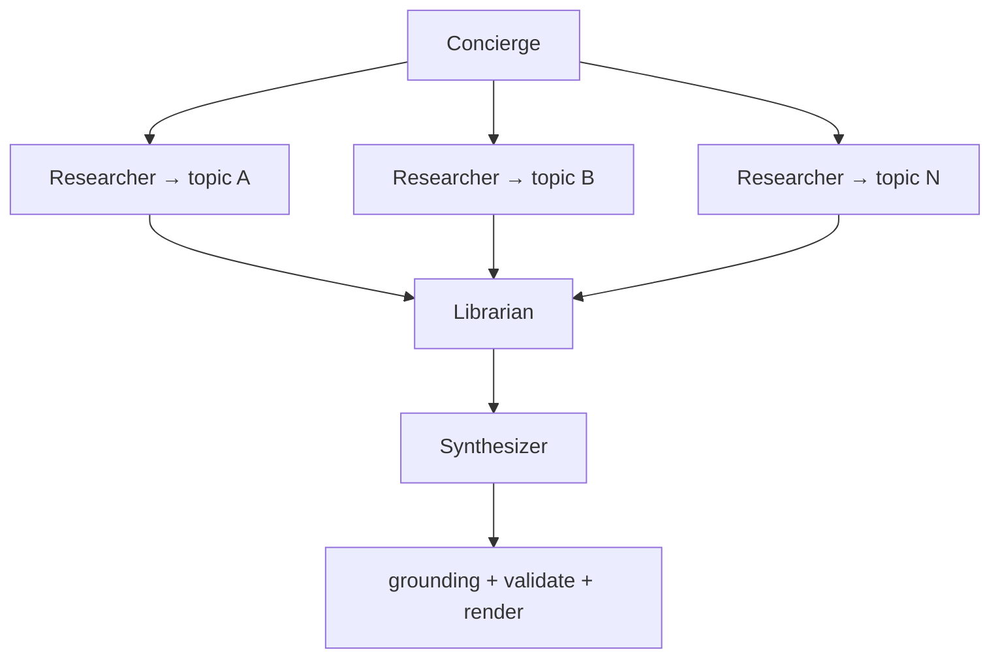

# Hermes system roles (ORIO crew)

Canonical role model for the agentic digest pipeline. Each row is **one profile**
(reusable across many tasks). An agent is a **role**, not a subject — never fork
a profile per category, company, or feed.

**ORIO** — *Open Research Intelligence Observatory* — is the internal codename for
AI Digest. Hermes profile names use the `orio_*` prefix; human-facing labels stay
**Concierge**, **Researcher**, **Librarian**, **Synthesizer**.

**Pipeline order:**

```
Concierge → Researcher × N (parallel) → Librarian → Synthesizer → grounding / validate / render
```

See also: [`working_agreements.md`](working_agreements.md) (artifact contracts,
tools vs pipeline invariants),
[`docs/ARCHITECTURE.md`](docs/ARCHITECTURE.md),
[`docs/202607_research/hermes-parallel-agents-walkthrough.md`](docs/202607_research/hermes-parallel-agents-walkthrough.md).

---

## How this doc relates to `working_agreements.md`

The design is split on purpose — some topics touch both:

| Question | Read here (`system_roles.md`) | Read there (`working_agreements.md`) |
|---|---|---|
| **Who** runs in the pipeline? | Role definitions, tier, wait conditions | — |
| **Who** do I ask to add a topic? | Concierge | — |
| **What** may each role do / not do? | Responsibility tables per role | Do / do-not tables with contract detail |
| **What** shape does each role output? | One-line output summary | Full schemas (`researcher_artifact/v1`, etc.) |
| **What** tools can researchers call? | — | Tool list, `verify_url`, thresholds |
| **What** is *not* a role? | Pipeline invariants (one paragraph) | Grounding, validation, provenance taxonomy |
| **How** do handoffs connect? | Task graph | End-to-end data-flow diagram |

**Rule:** roles and orchestration live here; schemas, tools, and invariants live
in `working_agreements.md`. Cross-links under each role point to the matching
agreement section.

---

## Roles at a glance

| Role | Profile name | Display name | Model tier | Waits on | Delivers to |
|---|---|---|---|---|---|
| [Concierge](#concierge) | `orio_concierge` | Concierge | Smart | User / cron ping | Task board |
| [Researcher](#researcher) | `orio_researcher` | Researcher | Fast | Concierge arms task | Librarian |
| [Librarian](#librarian) | `orio_librarian` | Librarian | Smart | All researcher tasks | Synthesizer |
| [Synthesizer](#synthesizer) | `orio_synthesizer` | Synthesizer | Smart | Librarian task | Report output |

**Not an agent role:** grounding guard, validation gates, and provenance stamping
run deterministically in `llm_pipeline` after synthesis — auditable, not
LLM-judged. See [`working_agreements.md`](working_agreements.md) for how these
differ from tools, skills, and MCPs.

---

## Role definitions

### Concierge

**Also called:** front desk (UX metaphor). **Do not call:** supervisor — that
implies quality policing by LLM, which conflicts with the deterministic guard.

→ Working agreement: [`working_agreements.md` § Topics guideline](working_agreements.md#concierge-topics-guideline)

| | |
|---|---|
| **Purpose** | Single point of contact for humans: standing topic list, schedule, intent routing, task-graph assembly. |
| **You ask them to…** | Add/remove a standing topic, change the digest schedule, say `GO`, edit the builder prompt, check board status. |
| **Model tier** | Smart — must parse intent and never confuse “update list” with “run now”. |
| **Inputs** | Chat/admin messages, cron trigger, memory (topic list, builder prompt, schedule). |
| **Outputs** | Kanban tasks; confirmation counts (“N research + 1 librarian + 1 synthesizer”). |
| **Does not** | Fetch sources, classify stories, write the digest, bypass config or grounding. |

**Intent taxonomy (planned):**

| Intent | Action | Runs pipeline? |
|---|---|---|
| `ADD_TOPIC` | Append to standing memory / propose config diff | No |
| `REMOVE_TOPIC` | Drop from standing memory | No |
| `GO` | Fan out researchers + librarian + synthesizer | Yes |
| `EDIT_BUILDER` | Update synthesizer prompt in memory | No |
| `STATUS` | Report board state and last run | No |

**Schedule pattern:** cron **pings** (“today’s topics — edit or GO”); user **replies**
in normal chat. Scheduled jobs cannot block waiting for an answer.

---

### Researcher

→ Working agreement: [`working_agreements.md` § Researcher](working_agreements.md#researcher-working-agreement)

| | |
|---|---|
| **Purpose** | Parallel fetch-and-summarize worker pointed at one target (category, feed cluster, or source bundle). |
| **You ask them to…** | Nothing directly — Concierge creates and assigns tasks. |
| **Model tier** | Fast / cheap — read pages, extract facts, post structured summaries. |
| **Inputs** | Task description (target + window), ingestion context from `llm_pipeline` fetch/parsers. |
| **Outputs** | Task artifact: raw story stubs, summaries, links, source notes — see `researcher_artifact/v1` in [`working_agreements.md`](working_agreements.md). |
| **Does not** | Dedupe across topics, remap to standing topic list, merge categories, render the digest. |

One profile handles every research task; only the **task body** changes per target.

---

### Librarian

→ Working agreement: [`working_agreements.md` § Librarian](working_agreements.md#librarian-working-agreement)

| | |
|---|---|
| **Purpose** | **Curatorial middle layer** between parallel research and final synthesis: sort, classify, regroup, dedupe, and map findings onto the standing **topics list** as a knowledge graph. |
| **You ask them to…** | Nothing directly — Concierge creates one librarian task per run; it wakes when all researchers finish. |
| **Model tier** | Smart — needs cross-document reasoning, taxonomy alignment, and merge decisions; cheaper than full report design. |
| **Inputs** | All researcher artifacts; standing topics list from Concierge memory / `config.yaml`; optional prior-run graph for continuity. |
| **Outputs** | **Curated digest skeleton** — see `librarian_artifact/v1` in [`working_agreements.md`](working_agreements.md): topic-aligned categories, deduped stories, knowledge graph, discovered topics with appendix hints. |
| **Does not** | Fetch new URLs, change the standing topic list, apply grounding (downstream), or produce final HTML/PDF. |

**Why between researchers and synthesizer**

Researchers optimize for **coverage and speed** per target. Left alone, the
Synthesizer inherits overlap, category drift, and weak cross-topic structure.
The Librarian is the **single fan-in before the final fan-out-to-deliverable**:

1. **Sort** — order by significance, recency, novelty within each topic.
2. **Classify** — assign each story to canonical topic IDs from the standing list.
3. **Regroup** — merge split coverage (same announcement from two feeds), split
   overloaded buckets, flag “misc” only when no topic fits.
4. **Knowledge graph mapping** — emit edges between stories/topics (`related_to`,
   `supersedes`, `same_event_as`, `feeds_topic`) so the Synthesizer can write
   executive narrative and charts with context, not a flat dump.

**Knowledge graph (librarian output shape, sketch):**

```yaml
topics: [aisearch, robotics, llm, ...]          # from Concierge standing list
nodes:
  - id: story:<hash>
    topic: robotics
    title: "..."
    significance: 4
edges:
  - from: story:a
    to: story:b
    rel: same_event_as
  - from: story:a
    to: topic:agentic-ai
    rel: feeds_topic
gaps:
  - topic: rag
    note: "No primary sources this window; carry-forward candidate"
overflow:
  - story: story:x
    note: "Below significance threshold; available if Synthesizer needs filler"
```

The Synthesizer reads this graph plus regrouped categories — not raw researcher
comments.

---

### Synthesizer

→ Working agreement: [`working_agreements.md` § Author](working_agreements.md#author-synthesizer-working-agreement)

| | |
|---|---|
| **Purpose** | Compose the **finished digest**: executive takeaway, daily summary, visual narrative, and deliverable (HTML archive; optional PDF/Telegram). |
| **You ask them to…** | Nothing directly — Concierge seeds the builder prompt in memory; one synthesizer task per run. |
| **Model tier** | Smart — positioning, prose, layout, chart design. |
| **Inputs** | Librarian curated skeleton + knowledge graph; builder prompt from memory; brand/style guide. |
| **Outputs** | Digest JSON via `synthesize_digest`; compatible with `llm_pipeline` render path. |
| **Does not** | Re-fetch sources, reclassify topics (Librarian’s job), hand-author full JSON, or skip downstream grounding/validation. |

Prompt style: **goal and output**, not install steps — hand a style guide and
section list; let the agent solve rendering setup.

---

## Task graph (per `GO`)



```yaml
# Example board after GO (4 standing topics)
tasks:
  - id: research-aisearch
    assignee: researcher
    parents: []
  - id: research-robotics
    assignee: researcher
    parents: []
  - id: research-llm
    assignee: researcher
    parents: []
  - id: research-design-ai
    assignee: researcher
    parents: []
  - id: librarian
    assignee: librarian
    parents: [research-aisearch, research-robotics, research-llm, research-design-ai]
  - id: synthesizer
    assignee: synthesizer
    parents: [librarian]
```

Concierge confirms: **“4 research + 1 librarian + 1 synthesizer.”**

---

## Comparison to `llm_pipeline` today

| Agentic role | Rough `llm_pipeline` equivalent |
|---|---|
| Concierge | `run.py` + admin + `config.yaml` (human-facing ops) |
| Researcher | Preflight + per-category enrich passes (parallelized) |
| Librarian | *New* — curation, dedupe, cross-category merge, topic graph |
| Synthesizer | Daily summary pass + `render.py` narrative/visual layer |
| Grounding guard | `grounding.py` + `validate.py` (unchanged, post-agent) |

The Librarian replaces implicit sorting that today happens inside sequential
enrich passes and gap-fill — but makes it **explicit, inspectable, and graph-shaped**
before the expensive final compose step.

---

## Model tier summary

| Tier | Roles | Rationale |
|---|---|---|
| Fast | Researcher | Fetch + summarize; many parallel calls |
| Smart | Concierge, Librarian, Synthesizer | Intent parsing, taxonomy/graph reasoning, editorial compose |

Local Ollama can host all roles initially; tier split matters when mixing cloud
models (e.g. flash researchers, pro synthesizer).

---

## Rules of engagement

1. **One profile per role** — scale by adding tasks, not cloning agents.
2. **Concierge owns the standing topics list** — Librarian maps *into* it, does not mutate it.
3. **Librarian is the only fan-in before synthesis** — Synthesizer never reads raw researcher output directly.
4. **Provenance is stamped by the pipeline**, not authored by any role.
5. **Grounding runs after Synthesizer** — deterministic demotion of bad links.
6. **List updates ≠ runs** — adding a topic never implies `GO`.

---

## Open questions

| Topic | Notes |
|---|---|
| Graph persistence | Store librarian graph per run prefix for diagnostics and trend charts? |
| Carry-forward | Librarian proposes carry candidates; Concierge/policy approves? |
| Topic list source of truth | Memory for speed, `config.yaml` for permanence — promotion flow TBD |
| Significance floor | Librarian filters vs Synthesizer uses overflow bucket |

Record decisions in this file as the design firms up.
