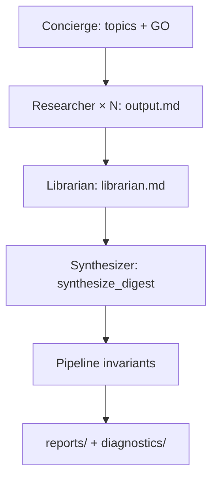

# Hermes working agreements

Contracts, tools, and pipeline invariants for the agentic digest. This doc
captures design decisions from the role-model discussions — what each agent
produces, what it may call, and what the pipeline enforces regardless of agent
behavior.

**Related:**

- [`system_roles.md`](system_roles.md) — **who** does what (roles, orchestration, task graph)
- [`docs/ARCHITECTURE.md`](docs/ARCHITECTURE.md) — system diagram vs `llm_pipeline`
- [`docs/202607_research/hermes-parallel-agents-walkthrough.md`](docs/202607_research/hermes-parallel-agents-walkthrough.md) — Hermes parallel-agents research

---

## How this doc relates to `system_roles.md`

| Topic | `system_roles.md` | `working_agreements.md` (here) |
|---|---|---|
| Role identity & tier | ✓ primary | cross-ref only |
| Waits-on / delivers-to | ✓ primary | in data-flow table |
| Intent taxonomy (Concierge) | ✓ primary | topics_guideline schema |
| Researcher / Librarian / Author duties | summary | ✓ primary (do-not, contracts) |
| Artifact JSON/YAML shapes | summary | ✓ primary |
| Tools vs pipeline invariants | pointer | ✓ primary |
| Dedup layers, graph edges | Librarian role intro | ✓ primary |

---

## By role — section index

| Role | Agreement section |
|---|---|
| Concierge | [Topics guideline](#concierge-topics-guideline) |
| Researcher | [Researcher working agreement](#researcher-working-agreement) |
| Librarian | [Librarian working agreement](#librarian-working-agreement) |
| Author (Synthesizer) | [Author working agreement](#author-synthesizer-working-agreement) |
| *(not a role)* | [Pipeline invariants](#pipeline-invariants-post-author) |

---

## Design principle: defense in depth

Agents do **first-pass** diligence and curation. The pipeline does **final,
authoritative** checks. Never trust a single LLM pass for link honesty or
provenance.

```
Agents (judgment)          Pipeline (invariants)
─────────────────          ─────────────────────
Researcher: verify links   Provenance: stamped by pipeline, not model
Librarian: dedupe/merge    Grounding guard: deterministic URL demotion
Author: compose narrative  Validation: category counts, required IDs
```

---

## Representation taxonomy

What grounding, validation, provenance, tools, skills, and MCPs *are* in this
system:

| Mechanism | Representation | Runs when | Example |
|---|---|---|---|
| **Grounding guard** | Pipeline invariant | Always, post-Author | `llm_pipeline/grounding.py` |
| **Validation gates** | Pipeline invariant | Always, post-Author | `llm_pipeline/validate.py` |
| **Provenance stamping** | Pipeline invariant | Always, post-Author | `_with_provenance` in enrich path |
| **Agent tools** | Callable functions | Agent chooses during work | `verify_url`, fetch, extract |
| **Artifact schemas** | Working agreement (contract) | Every handoff between roles | `researcher_artifact/v1` |
| **Depth / topic rules** | Config + profile prompt | Per role, tunable | `config.yaml` + profile YAML |
| **Skills** | Optional playbooks | Human/agent guidance only | How to fill a contract |
| **MCP servers** | External integration | When wiring orchestration | Kanban board, Telegram — not core guard logic |

### Quick rules

- If it must **always** run the same way → **pipeline invariant** (not a tool)
- If the agent **chooses when** to invoke it → **tool**
- If it defines **data shape at a handoff** → **contract / schema**
- If it explains **how to behave** → **profile prompt** (+ optional skill doc)
- **Do not** implement grounding or provenance as MCPs or optional skills — they
  are mandatory finalizers

### Mapping to `llm_pipeline` today

| Invariant / tool | Current module |
|---|---|
| Story LLM contract | `llm_pipeline/schema.py` (`StoryEnrich`) |
| URL verify tool | `llm_pipeline/tools.py` (`verify_url`) |
| Grounding guard | `llm_pipeline/grounding.py` |
| Validation | `llm_pipeline/validate.py` |
| Provenance | Stamped after enrich; model never authors it |

Hermes extends schemas for inter-agent artifacts; invariants stay in
`llm_pipeline`.

---

## End-to-end data flow



| Handoff | Contract | Consumer |
|---|---|---|
| Concierge → Researcher | Task prompt + topics guideline + config thresholds | Researcher |
| Researcher → Librarian | `researcher_artifact/v1` | Librarian |
| Librarian → Synthesizer | `librarian.md` (+ staged copy) | Synthesizer (`synthesize_digest`) |
| Synthesizer → Pipeline | `digest.json` | Grounding, validate, provenance, render |

---

## Concierge: topics guideline

→ Role overview: [`system_roles.md` § Concierge](system_roles.md#concierge)

Output to all roles (memory + config). Defines the **standing topic list** and
rules for discovered material.

```yaml
topics_guideline/v1:
  standing_topics:
    - id: aisearch
      required: true
    - id: robotics
      required: true
    - id: rag
      required: false
  appendix_policy: include_linked_discoveries   # or omit | summary_only
  depth_defaults:
    max_subtopics: 5
    max_sources_per_story: 3
    significance_floor: 2
```

- **Concierge owns** the standing list — Librarian maps into it; does not mutate it.
- **Discovered topics** are proposed by Librarian, not added silently by agents.

---

## Researcher working agreement

→ Role overview: [`system_roles.md` § Researcher](system_roles.md#researcher)

### Responsibilities (first pass, per target)

| Do | Do not |
|---|---|
| Fetch and summarize assigned target | Cross-target dedup (Librarian) |
| Due diligence — primary URLs, facts | Final topic placement (Librarian) |
| Configurable depth — stop at threshold | Author provenance tokens |
| Extract keywords, entities, links, tags | Skip contract fields |
| Call `verify_url` on cited links | Rely on verify alone — pipeline re-checks |
| **Local dedup** within this target only | Merge with other researchers' output |

### Configurable thresholds (from Concierge / config)

- `max_subtopics` — how deep to drill sub-themes
- `max_sources_per_story` — breadth cap
- `significance_floor` — stories below this go to `overflow[]`, not dropped
- `time_budget` / `stopped_reason` — document why exploration stopped

### Tools available to Researcher

| Tool | Purpose |
|---|---|
| `verify_url` | HEAD/GET check; record result on story |
| Fetch / scrape | Ingestion via `llm_pipeline` fetch parsers |
| `web_search` | Optional gap repair (if enabled) |
| Link extract | Pull URLs from page content |

Tools are **optional to invoke**; pipeline invariants are **not**.

### Output contract: `researcher_artifact/v1`

Every researcher emits this shape so the Librarian can parse any task uniformly.

```yaml
schema: researcher_artifact/v1
target_id: robotics              # task target — not canonical topic yet
window:
  start: "2026-06-25"
  end: "2026-07-05"
stories:
  - id: stub:<content-hash>
    title: "Humanoid demo at ..."
    summary: "..."
    url: "https://..."             # or null
    source_pending: false
    keywords: [humanoid, locomotion]
    entities: [{ name: "Figure", type: org }]
    significance: 4                # researcher's estimate
    links_checked: true
    verify_url_result: ok          # ok | redirect | dead | skipped
    local_dedupe_key: "<hash>"     # hint for librarian merge
sub_topics_explored:
  - name: "humanoid locomotion"
    depth: 2
    stopped_reason: threshold      # threshold | exhausted | time_budget
overflow:                          # below significance_floor, kept for librarian
  - id: stub:<hash>
    title: "..."
    significance: 1
researcher_notes: ""               # optional; not for publish verbatim
```

Aligns with `llm_pipeline/schema.py` `StoryEnrich` fields where possible; extended
for agent handoff metadata.

---

## Librarian working agreement

→ Role overview: [`system_roles.md` § Librarian](system_roles.md#librarian)

### Responsibilities

| Do | Do not |
|---|---|
| Sort by significance, recency, novelty | Fetch new URLs |
| Classify stories → canonical topic IDs | Change standing topic list |
| Regroup — merge cross-feed duplicates | Write final narrative (Author) |
| Build knowledge graph (nodes + edges) | Apply final grounding (pipeline) |
| Flag gaps and carry-forward candidates | Drop discovered topics silently |
| Package appendix material for Author | |

### Two-layer dedup

1. **Researcher** — local, within one target (parallel-safe)
2. **Librarian** — global, cross-researcher (canonical merge semantics)

Researchers stay independent; Librarian owns merge decisions.

### Knowledge graph relations

| Edge | Meaning |
|---|---|
| `same_event_as` | Two stories, one announcement |
| `feeds_topic` | Story supports a standing topic |
| `subtopic_of` | Sub-theme under a topic |
| `related_to` | Thematic link, not same event |
| `proposed_topic` | New discovery linked to nearest standing topic |

### Output contract: `librarian_artifact/v1`

```yaml
schema: librarian_artifact/v1
topics_applied: [aisearch, robotics, llm]    # from topics_guideline
categories:
  - id: robotics
    stories: [...]                            # deduped, sorted
graph:
  nodes:
    - { id: story:<hash>, type: story }
    - { id: topic:robotics, type: topic }
    - { id: proposed:vector-db-kernels, type: proposed_topic }
  edges:
    - { from: story:a, to: story:b, rel: same_event_as }
    - { from: story:a, to: topic:robotics, rel: feeds_topic }
    - { from: proposed:vector-db-kernels, to: topic:rag, rel: subtopic_of }
discovered_topics:
  - id: proposed:vector-db-kernels
    title: "Vector DB kernel optimizations"
    linked_to: topic:rag
    placement_hint: appendix              # inline | appendix | omit
appendix: [...]                           # related / sub-threshold material
gaps:
  - topic: rag
    note: "No primary sources; carry-forward candidate"
overflow: [...]                           # passed through from researchers
```

---

## Author (Synthesizer) working agreement

→ Role overview: [`system_roles.md` § Synthesizer](system_roles.md#synthesizer)

Also called **Synthesizer** in profiles and task board.

### Responsibilities

| Do | Do not |
|---|---|
| Read `librarian.md` (staged into workspace) | Read raw researcher artifacts directly |
| Call **`synthesize_digest`** with workspace + run prefix | Hand-author full `digest.json` |
| Verify `digest.json` exists before `kanban_complete` | Re-fetch or reclassify |
| Complete with real artifact paths | Emit stub JSON or narrate completion |

### Tool surface

| Tool | Purpose |
|---|---|
| `synthesize_digest` | Instructor LLM per category + summary → `digest.json` |
| `kanban_show` / `kanban_complete` | Worker protocol |
| `file` / `terminal` | Read librarian, inspect workspace |

Carry-forward for categories not in the librarian merge is handled inside
`synthesize_digest` (pinned baseline digest) — not a render bypass.

### Output

Digest JSON matching existing report schema + `llm_pipeline/render.py` path.
Builder prompt lives in Concierge memory (Hermes pattern).

---

## Pipeline invariants (post-Author)

These run **every run**, regardless of agent quality. Not tools, not skippable.

### 1. Provenance stamping

- Deterministic token per story (`skeleton:`, `gap:`, `agent:researcher:…`, etc.)
- **Never** model-authored — orchestrator or pipeline stamps after agent output
- Clickable trace in UI (existing digest widget behavior)

### 2. Grounding guard

- Demote ungrounded URLs (`url → None`, `source_pending`)
- Bare domains, leaderboard roots, URLs outside ingestion allow-set
- Leaderboard category exempt where appropriate
- See `llm_pipeline/grounding.py`

### 3. Validation gates

- `min_total_stories`, `min_categories`, `required_category_ids`
- Significance / curation sanity checks
- `fail_on_missing` per config
- See `llm_pipeline/validate.py`

### 4. Render

- `generator_version`, archive index, diagnostics waterfall
- See `llm_pipeline/render.py`

---

## Skills and MCPs (when to use)

### Skills (optional)

Markdown playbooks for humans and coding agents — e.g. “how to fill
`researcher_artifact/v1`”. They **describe** contracts; they do **not** enforce
them. Schemas and pipeline code enforce.

### MCPs (optional, orchestration layer)

Use for **external surfaces**, not core truth:

| MCP candidate | Role |
|---|---|
| Kanban / task board | Concierge creates fan-out graph |
| Telegram / chat | Ping, GO, add topic |
| Memory store | Standing topics, builder prompt |

Do **not** put grounding or provenance behind MCP — keep them in-repo,
deterministic, testable with fixtures.

---

## Summary table

| Layer | Representation | Enforced by |
|---|---|---|
| Grounding | Pipeline invariant | Python guard |
| Validation | Pipeline invariant | Python gates |
| Provenance | Pipeline invariant | Pipeline stamper |
| Researcher output | `researcher_artifact/v1` | Schema validation at handoff |
| Librarian output | `librarian_artifact/v1` | Schema validation at handoff |
| Link check during research | Tool (`verify_url`) | Researcher + pipeline |
| Topic list | Topics guideline | Concierge memory / config |
| Role behavior | Profile + prompt | Agent runtime |
| Playbooks | Skills (optional) | Documentation only |

---

## Open questions

| Topic | Status |
|---|---|
| JSON Schema / Pydantic models for v1 artifacts | Not implemented |
| Where to validate handoff schemas | Librarian task entry? pipeline middleware? |
| Carry-forward: Librarian proposes, Concierge approves? | TBD |
| Graph persistence per run prefix for diagnostics | TBD |
| Promote `proposed_topic` → standing topic via Concierge | TBD |

Update this file as contracts firm up and code lands.
