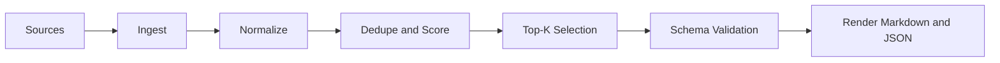
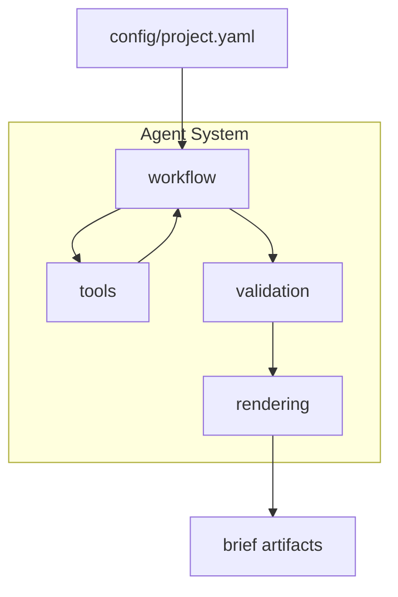

# Architecture Draft

## Flow

1. Ingest source items
2. Normalize fields (title, url, summary, source)
3. Score and deduplicate
4. Select top cards
5. Validate output schema
6. Render markdown and json

## Components

- tools: source adapters
- workflow: orchestration logic
- validation: schema checks
- rendering: user-facing output

