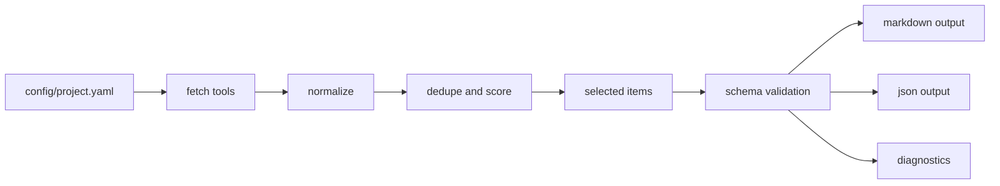

# Data Flow

1. config/project.yaml defines sources.
2. tools fetch and normalize items.
3. normalized items enter dedupe and scoring.
4. selected items pass schema validation.
5. renderer writes markdown and json outputs.
