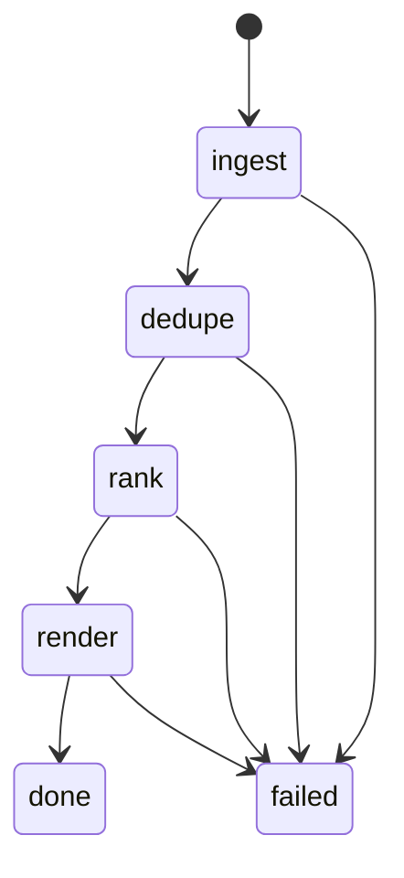

# State Model

## Run State

- run_id
- started_at
- phase: ingest | dedupe | rank | render | done | failed
- source_status map
- errors list

## Task State

- task_id
- input_digest
- attempts
- result_status
