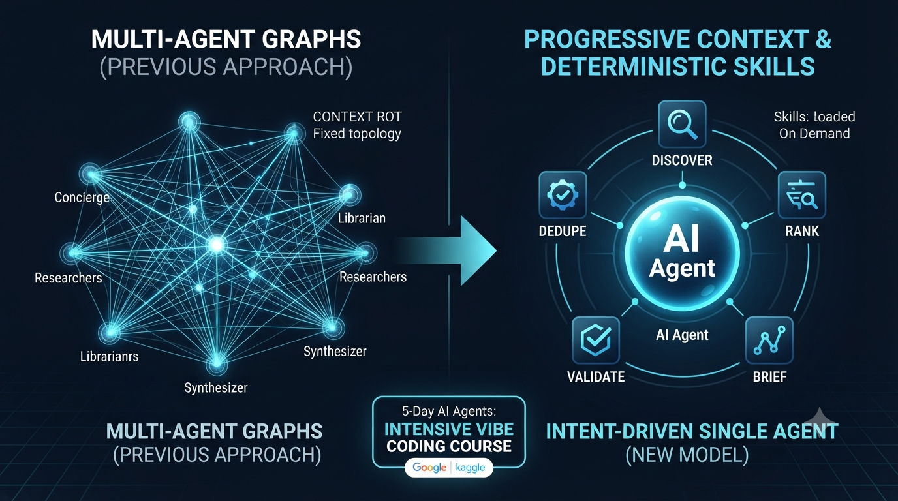

# LinkedIn Posts

## 5-Day AI Agents Intensive Vibe Coding Course (Google + Kaggle)

Just wrapped the **5-Day AI Agents: Intensive Vibe Coding Course** from **Google** and **Kaggle** — and it quietly changed how I think about building agents.

Two shifts stuck with me:

**1. From multi-agent graphs → a single agent with progressive context.**
My instinct (and my current production pipeline) was a graph: concierge → researchers → librarian → synthesizer. It works, but every hand-off re-reads overlapping context, and you end up with summaries of summaries — context rot. The course reframed this: one agent, with Skills loaded *on demand* via progressive disclosure (advertise → load → read → run). The context stays fresh because the agent decides what it reads, not a fixed topology. Simpler, and honestly more maintainable.

**2. From code assistance → a factory model with intent-driven development.**
The real unlock isn't autocomplete. It's expressing *intent* — "discover, dedupe, rank, validate, brief" — and letting deterministic Skills (a validation script beats LLM guessing for any pass/fail check) do the exact work. You stop writing steps and start governing outcomes.

The thread underneath both: **state you can govern.** The "Always-On Agents" survey the course pointed to says it well — a memory that scores perfectly on recall can still be unsafe with no authority boundary, no provenance, and no path to repair. Recall is easy; governance, recovery, and knowing when to *relinquish* state is the hard part.

I built the capstone as a single-agent AI news curator to put all of this into practice — treating every fetched item as untrusted input and validating the schema before anything ships.

Grateful to the **Google** and **Kaggle** teams for a course that was equal parts hands-on and genuinely thought-provoking. Highly recommend it to anyone moving from "using LLMs" to "building agents that run in production."

🔗 Links
- Course: https://www.kaggle.com/competitions/5-day-ai-agents-intensive-vibecoding-course-with-google
- Capstone competition: https://www.kaggle.com/competitions/vibecoding-agents-capstone-project
- Kaggle Learn Guide (5-Day Agents): https://www.kaggle.com/learn-guide/5-day-agents
- "Always-On Agents" survey: https://arxiv.org/abs/2606.30306

\#AI #Agents #Kaggle #Google #LLM #MachineLearning #AIEngineering
