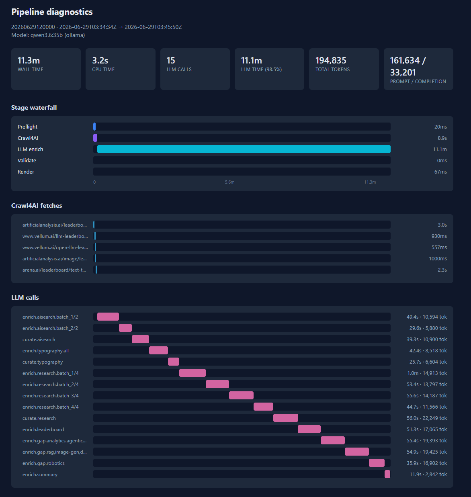

# LLM pipeline — early exploration

Before the agentic cutover, AI Digest was built and benchmarked as a **staged
batch pipeline** under [`llm_pipeline/`](../llm_pipeline/). That chapter proved
the digest format and grounding model; the full evolution story is in **[README.md](../README.md#how-it-evolved)**.

This doc is the historical reference for that path. It shares ingestion, grounding,
validation, and render with Hermes, and remains useful for regression baselines
and parser work.

---

## What it was

A fixed four-stage run triggered by `run.py`:

```
run.py  →  llm_pipeline/
  ├─ [1] Ingest   chapters, typography, research, Crawl4AI leaderboards
  ├─ [2] Enrich   Ollama + Instructor: summarize, score, gap-fill
  ├─ [3] Validate categories, grounding
  └─ [4] Render   HTML + reports/index.html + diagnostics/*
```

| Stage | Role |
|-------|------|
| **Ingest** | Prefetch feeds, crawl leaderboards, structured API sources |
| **Enrich** | Sequential LLM passes per editorial category |
| **Validate** | Category coverage, deterministic grounding guard |
| **Render** | HTML widget, archive index, diagnostics waterfall |

Eleven editorial categories. Tuning notes: **[TUNING.md](TUNING.md)**.



---

## Why we moved on

The staged pipeline proved the digest format, grounding model, and render quality.
What it did not scale cleanly was **parallel research**, **explicit merge/curation**
between topics, and **human-in-the-loop** triggers (chat, kanban, schedule).

Hermes replaces sequential orchestration with role-based workers while keeping
the invariants that made the pipeline trustworthy:

| Invariant | Carried forward |
|-----------|-----------------|
| Deterministic grounding | Same `grounding.py` / `validate.py` after synthesis |
| Provenance tokens | Stamped by pipeline metadata, not model output |
| Digest JSON schema | Identical render path via `render.py` |
| Shared ingestion | `lib/ingest/` used by both paths |

See [`agentic/hermes/docs/ARCHITECTURE.md`](../agentic/hermes/docs/ARCHITECTURE.md)
for how each pipeline stage maps to an agent role.

---

## Run it (baseline)

```bash
git clone https://github.com/mameen/AI_Digest.git
cd AI_Digest
python admin/manage.py bootstrap

ollama pull llama3.1          # dev default (~5 GB, 128K ctx)
python run.py --start 2026-06-29 --history 10
```

| Path | Contents |
|------|----------|
| `llm_pipeline/reports/` | Digest JSON/HTML from staged runs |
| `llm_pipeline/diagnostics/` | Timing and token telemetry |
| `llm_pipeline/.cache/` | Prefetch cache (gitignored) |

Publish selected runs into the live site:

```bash
python scripts/deploy_app.py --pipeline --all --not-dry-run
```

---

## Hardware notes

**Dev / laptop:** `llama3.1:latest` in `llm_pipeline/config.yaml`.

**Showcase quality:** `qwen3.6:35b` on an **NVIDIA RTX 4090** (~24 GB) —
published digests at ~10–12 min wall time, ~150–200k tokens per run
(see `llm_pipeline/diagnostics/`).
